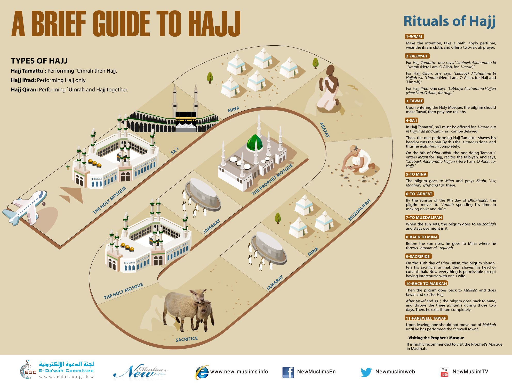
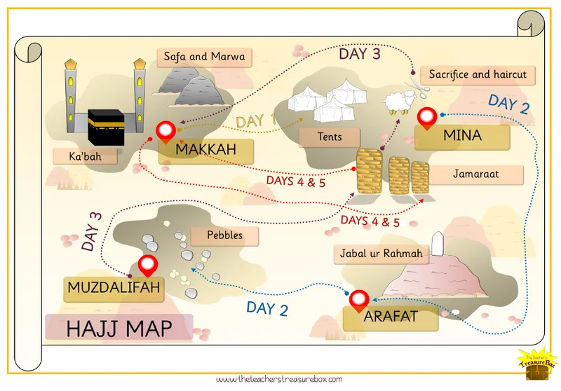
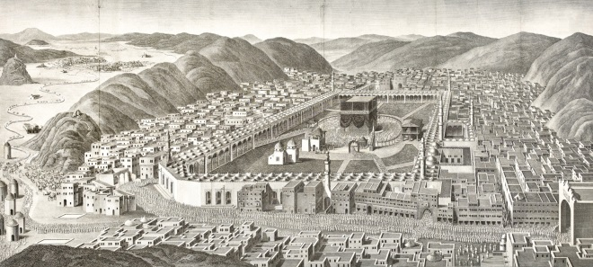
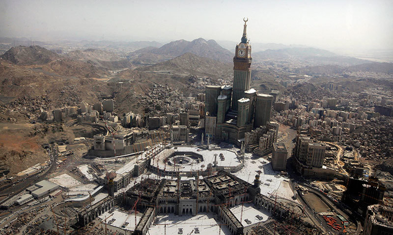
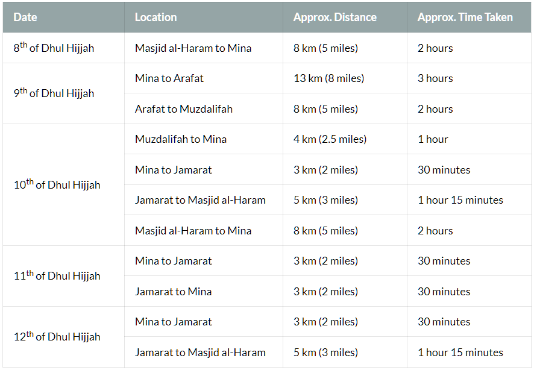

<b></b> 
 Hajj-Tamattu (Sunni view, mostly Hanafi school)   

The Best Hajj Guide I could find: [hajjumrahplanner.com](https://hajjumrahplanner.com/hajj-guide/)

## Hajj-Tamattu Roadmap
------------------------------------------------------

### Short Roadmap

 This is my personalized plan for Hajj Al-Tamattu. 

 

### Umrah

<cr>0.1</cr> Entering Ihram and make niyah for umrah \
<cr>0.2</cr> Tawaf 🕋 \
<cr>0.3</cr> Praying 2 raqat behind Maqam Ibrahim \
<cr>0.4</cr> Sai between Safa and Marwa \
<cr>0.5</cr> Trim the hair

### Day 1 (8th Dhul Hijjah): Yawm al-Tarwiyah (Tahim he Day of Quenching Thirst)	

<cr>1.1</cr> Enter into Ihram and make niyah for hajj \
<cr>1.2</cr> Proceed to Mina before Dhuhr \
<cr>1.3</cr> Perform your Dhuhr, Asr, Maghrib and Isha in Mina \
<cr>1.4</cr> Stay there overnight

### Day 2 (9th Dhul Hijjah): Yawm al-Arafat (The Day of Arafat) or Yawm al-Wuquf (The Day of Standing)

<cr>2.1</cr> Perform Fajr in Mina \
<cr>2.2</cr> Proceed to Arafat \
<cr>2.3</cr> Perform Dhuhr and Asr in Arafat \
<cr>2.4</cr> Proceed to Muzdalifah after sunset \
<cr>2.5</cr> Perform Maghrib and Isha in Muzdalifah \
<cr>2.7</cr> Stay there overnight \
<cr>2.6</cr> Collect pebbles \
<cr>2.8</cr> Perform Fajr Salah and make Dua \
<cr>2.9</cr> Proceed to Mina before sunrise

### Day 3 (10th Dhul Hijjah): Yawm al-Nahr (The Day of Sacrifice)	

<cr>3.1</cr> Perform Rami (pelting) of Jamarah al-Aqaba (the big pillar, 7 pebbles) \
<cr>3.2</cr> Hady (animal sacrifice) \
<cr>3.3</cr> Perform Halq/Taqsir (get your hair shaved or trimmed) \
<cr>3.4</cr> Proceed to Makkah \
<cr>3.5</cr> Perform Tawaf al-Ziyarah 🕋 \
<cr>3.6</cr> Sai between Safa and Marwa \
<cr>3.7</cr> Go back to Mina (unless you have a valid excuse to stay in Makkah)

### Day 4,5,6 (11th, 12th, 13th Dhul Hijjah): Ayyam</cr> al-Tashreeq (The Days of Drying Meat)

<cr>4.1</cr> Perform Rami of all three Jamarat on each day (7 pebbles each, small-dua-middle-dua-big) \
<cr>4.2</cr> Proceed to Makkah \
<cr>4.3</cr> Perform Tawaf al-Wida 🕋

 

1. Enter into the state of Ihram at the Miqat with the intention of performing Umrah. This Umrah must be completed during the period of Hajj of the same year, prior to beginning the actual Hajj itself.
2. Proceed to Makkah where you will begin the rites of Umrah.
3. Upon reaching Makkah, perform Tawaf al-Umrah.
4. Perform two Rakats of Salah at Maqam Ibrahim (if possible) and partake in the drinking of Zamzam water.
5. Proceed to Safa in order to perform Sa’i. This is separate from the Sa’i performed during Hajj.
6. Perform Halq or Taqsir. Men are recommended to have their hair trimmed rather than shaved as they will have their heads shaved at a later stage during Hajj. Women must have their hair trimmed.
	> Your Umrah is now complete and the restrictions of Ihram have now been lifted. You can shower and wear your everyday clothes. You will wait for the 8th of Dhul Hijjah to the start the rites of Hajj.
7. On the 8th of Dhul Hijjah, make a new intention for Hajj at your place of residence.
You will once again enter into a state of Ihram in the prescribed manner. There is no need to go to any particular Miqat to enter Ihram.
8. You will go to Mina, pray there Dhuhr, Asr, Maghrib, Isha, sleep under the open sky and pray Fajr.
9. After Fajr in Mina, go to Arafat. Listen to khutbah, make duas (how many hours?).
10. Go to Muzdalifah to collect stones.
11. Stoning the devil.
12. An animal sacrifice is required for Hajj al-Tamattu. Sacrificial animals are available in Mina and should be able to be arranged through your agent.
13. Eid Al-Adha (Festival of Sacrifice)

 

## Glossary

- **Rukn** (Arabic: ركن; pl. Arkan أركان; meaning “pillar”), in Islamic jurisprudence, refers to an obligatory act, with failure to perform it rendering the act invalid. If a Rukn is neglected, the entire act must be repeated. It cannot be expiated by virtue of offering Fidyah.
- **Fidyah** (Arabic: فدية; meaning “expiation”) is a means of compensation for a missed action or a violation of a Hajj-related law. It shouldn’t be regarded as a punishment, but a means of rectifying and renewing your commitment to the pilgrimage and the Sunnah of Rasulullah ﷺ  .
- **Wajib** (Arabic: واجب), in Islamic jurisprudence, refers to an obligatory act, with failure to perform it constituting a sin. Wajib is generally synonymous with “Fardh”, although the Hanafi school of thought make a distinction between the two with the view that something that is Fardh is proven by means of definitive evidence, whereas something that is Wajib is proven on the basis of ambiguous evidence, where there is possibly more than one meaning.
- **Miqat** (Arabic: ميقات) refers to the boundary where it becomes necessary for pilgrims to adorn the Ihram garments and impermissible to pass except in the state of Ihram. Those who cross the boundary without having entered into the state of Ihram must perform an animal sacrifice (Damm) as expiation.
- **Halq** The complete shaving of the head by the male pilgrim on the 10th of Dhul-Hijjah. This is the last thing he does before getting out of the state of ihram. See also taqseer. For female pilgrims, the requirements of halq and taqseer are satisfied if they trim their hair by approximately half an inch.
- **Hateem** The area adjacent to the Kabah on its west side, enclosed by a low semi-circular wall. Tradition has it that Hajar (wife of Prophet Ibrahim [peace and blessings be upon him]) is buried in this enclosure. It is highly recommended that the pilgrim offer sunnah Prayer and supplications to Allah in this area. However, this is not a part of the official rites of Hajj.
- **Kiswah** The black cloth that drapes the Kabah. It is embroidered in gold thread with the Shahadah, praises of Allah, and verses of the Qur’an.
- **Mutawwif** A knowledgeable professional who can guide the pilgrim during Hajj.
- **Muhrim** A pilgrim in the state of ihram.
- **Taqseer** Shortening or clipping of the whole head of hair by the male pilgrim following the completion of Hajj. This may be performed in lieu of halq (shaving). However, snipping off a few hairs here and there is not acceptable. The sunnah of the Messenger of Allah (peace and blessings be upon him) supports only taqseer and halq.
- **Tawaf Al-Ifadah** The Tawaf performed by the pilgrim on the 10th of Dhul-Hijjah as the last formal rite of Hajj in Makkah after changing into street clothes. Also called Tawaf Az-Ziyarah. 
- **Tawaf An-Nafl** A devotional Tawaf that may be performed any time. Tawaf Al-Qudum The initial Tawaf performed by the pilgrim upon entering Al- Masjid Al-Haram in Makkah pursuant upon his intention for Hajj. 
- **Tawaf Al-Umrah**  The Tawaf performed as a rite of Umrah. 
- **Tawaf Al-Wada** The Farewell Tawaf performed by the pilgrim just before leaving Makkah for his next destination.
- **Wuquf** (meaning “standing”) is the act of being present, even for a moment, at a particular place during Hajj. The Wuquf at Arafat on the 9th of Dhul Hijjah is an integral rite of Hajj and its non-performance invalidates the entire pilgrimage. The Wuquf at Muzdalifah performed after Fajr on the 10th of Dhul Hijjah, just before leaving for Mina, is regarded as a Sunnah.

Full Glossary:
https://islamonline.net/en/glossary-of-hajj-related-terms/

## Kaaba Before and Now 🕋

I like to compare the scale of buildings in these two pictures.

 
 

## Hajj History and Meaning

## Short Introduction

	And (due) to Allah from the people is a pilgrimage to the House - for whoever is able to find thereto a way.
	The Holy Qur'an

The Prophet Muhammad SAW heralded that those who complete hajj by abandoning the desires of nafs and lust, and avoiding sins and evil will be as much clean as the day they were born. Prophet Muhammad SAW stated:

> "The reward of hajj accepted by Allah SWT is nothing but heaven."
>
> Bukhari, Muhsar, 10; Umrah, 1.

The best and the most sophisticated website with hajj and umrah guides that I could find in English: **[hajjumrahplanner.com](https://hajjumrahplanner.com)**

### Hajj Types
-------------------------------------------------

There are three main types of Hajj, the annual Islamic pilgrimage to Mecca, Saudi Arabia, that are recognized by Islamic scholars:

- **Hajj-ul-Tamattu**: This is the most common type of Hajj, and it involves performing the rituals of Hajj and the pilgrimage to Mecca during the designated days of the Hajj.
- **Hajj-ul-Qiran**: This type of Hajj involves performing the rituals of both the Hajj and the lesser pilgrimage, known as the Umrah, at the same time. The rituals of the Umrah can be performed at any time during the year, but the Hajj must be performed during the designated days of the Hajj.
- **Hajj-ul-Ifrad**: This type of Hajj involves performing only the rituals of the Hajj, without also performing the rituals of the Umrah. This type of Hajj is less common and is typically only undertaken by those who are unable to perform the other types of Hajj due to physical or financial limitations.

It is important to note that all three types of Hajj involve the same core rituals and ceremonies, and they are all considered to be valid and acceptable forms of the pilgrimage. The choice of which type of Hajj to perform is a personal decision that is based on individual circumstances and preferences.

In this articale, I will focus on Hajj ul-Tamattu because that is the target of the majority of Muslims who plan their hajj including myself.

#### Links and References

- [The Best Hajj Guide](https://hajjumrahplanner.com/hajj/)
- [Valuable Tips for Hajj](https://www.islamicity.org/12445/getting-ready-for-hajj-physically-mentally-and-spiritually/)
- [Another Guide](https://www.islamic-relief.org.uk/islamic-resources/hajj-in-islam/hajj-guide/)
- hujjaj.co traveller's tips: https://www.youtube.com/watch?v=Eryvb08ocDA
- [Hajj Guide by Omar Suleiman]()
- Hajj Guide by Yasir Qadhi [Part 1](), [Part 2]()
- [Young Hamza Yusuf about Hajj](https://www.youtube.com/watch?v=Kswxexj6m00)
- [Makkah Live](https://www.youtube.com/watch?v=3loPeQnJKk4)
- [Hajj Documentary -- Sacred Journey](https://www.youtube.com/watch?v=liPFurz5Rn0) 
- [some footage](https://www.youtube.com/watch?v=q7q_LcqbvKI)
- [professional footage](https://www.youtube.com/watch?v=FiE-Pd9Amz0)

#### Official Hajj Ministry Links

- https://hajj.nusuk.sa
- https://twitter.com/motawif_sa
- https://www.facebook.com/Motawif/
- https://www.haj.gov.sa/en
- https://twitter.com/MoHU_En?t=WQM4tACX9VwY82PwJ0zAMg&s=08

#### Dua Collection for Hajj

[Hajj Duas](https://thepilgrim.co/list-of-hajj-duas/)
[Essential Duas for Hajj and Umrah](https://muslimhands.org.uk/latest/2019/08/a-list-of-essential-duas-for-hajj-and-umrah)

## Overview

Hajj is an annual Islamic pilgrimage to Mecca, Saudi Arabia, and is one of the five pillars of Islam. It is a mandatory religious duty for Muslims who are physically and financially able to undertake the journey at least once in their lifetime. The pilgrimage takes place during the last month of the Islamic calendar, called Dhu al-Hijjah, and involves a series of rituals and ceremonies that are performed over a period of several days.

During the Hajj, Muslims visit the Kaaba, a sacred shrine in Mecca, and perform a series of rituals, including circling the Kaaba seven times, running between the hills of Safa and Marwah, and standing in prayer on the plain of Arafat. They also perform the ritual of stoning the Devil and make an animal sacrifice.

The Hajj is a time of intense spiritual reflection and devotion for Muslims, and it is believed that those who complete the pilgrimage with a pure heart and intention will have their sins forgiven. It is also an opportunity for Muslims from all over the world to come together in unity and reaffirm their faith in God.

Resurrecting what Ibrahim did 4000 years ago.

## How many people visit Mecca

The Hajj to Mecca in Saudi Arabia is considered the world's largest human gathering with almost **2.5 million pilgrims** in 2019. 

## Time

5 days of Hajj start from 8th of Dhul Hijja to 12th of Dhul Hijja.

In 2023, it will be from 26 June till 1 July.

## Obligation of Hajj

	In it are clear signs [such as] the standing place of Abraham. And whoever enters it shall be safe. And [due] to Allah from the people is a pilgrimage to the House – for whoever is able to find thereto a way. But whoever disbelieves – then indeed, Allah is free from need of the worlds.
	Qur'an, surah Aali Imran (The Family of Imran) 3:97

As well as highlighting the obligation of hajj, this verse also declares that sincerity of intention and the ability to undertake the journey are also prerequisites for performing Hajj. The verse also alludes to the fact that rejection of the obligation of Hajj is almost equivalent disbelief.

The majority of the scholars hold the view that Hajj was prescribed in the sixth year after Hijrah with the revelation of the following verse:

	And complete the Hajj and Umrah for Allah.
	Qur'an, surah Al-Baqarah (The Cow) 2:196

Other scholars are inclined to the view that Hajj was made obligatory in the ninth or the tenth year of Hijrah.

Umar said those who have means to go to Hajj and didn't go, I might as well put jizyah on them.

## Becoming a guest of Allah

When a person decides to do pilgrimage and undertakes this journey, he becomes a guest of Allah.

> Allah has invited you to His House, which He has called the Bayt al-‘Atiq – the ancient,
liberated and liberating house. Your journey is one of freedom and liberation. For as
your body leaves its material house to journey to Allah’s House, your heart is meant to
disengage from the lower self (nafs), the shaytan, and the world (dunya) and journey to
Allah.
>
> The ultimate reward for a **Hajj mabrur** is to return home with the purity of a newborn
child. What could be a greater incentive! But beware, for Hajj is a selective process.
Only a few will attain a Hajj mabrur, which is a Hajj performed correctly, without any
disobedience to Allah and without indulging in any argumentation. Be prepared. Be
vigilant. Be focused. This will be one of the greatest – and sweetest – struggles of your
life. And though you will long and dream for the rest of your life to come back, you may
never return again.
>
> May Allah allow our bodies to journey to His House; may He permit our hearts to find
Him, the Lord of the House. Ameen.
> This passage is from a lecture by Shaykh Mokhtar Maghraoui on the internal dimensions of Hajj.

## Mecca

* [Some fascinating photos of Mecca in 1887 and 2015](https://www.theatlantic.com/photo/2015/09/mecca-then-and-now-128-years-of-growth/408013/)
* [Collection of Kaaba photos](http://www.bev.ba/MOMARAFO/MAGNETASGOOD/KAABA/index.html)

### Some hadiths about Hajj

Sahih Bukhari has a whole chapter about hajj (HADITH 1513-1772).

## Hajj is among best of deeds

Abu Huraira reports:
> The Prophet ﷺ   was asked: ‘What is the best deed?’ He replied: ‘To have faith in Allah and His Messenger.’ The enquirer asked: ‘What next?’ The Prophet ﷺ   said: ‘To strive in the cause of Allah.’ He was then asked: ‘What is the next best thing?’ He replied: ‘To perform Hajj Mabrur’.

## On Hajj Mabrur

Narrated Abu Huraira:
> The Prophet (p.b.u.h) said, "Whoever performs Hajj for Allah's pleasure and does not have sexual relations with his wife, and does not do evil or sins then he will return (after Hajj free from all sins) as if he were born anew."
>
> Bukhari, Volume 2, Book 26, Number 596:

## On taking Provisions

Narrated Ibn Abbas:
> The people of Yemen used to come for Hajj and used not to bring enough provisions with them and used to say that they depend on Allah. On their arrival in Medina they used to beg the people, and so Allah revealed, `"And take a provision (with you) for the journey, but the best provision is the fear of Allah."` (2.197).
>
> Bukhari, Volume 2, Book 26, Number 598:

## Where to assume Ihram

Narrated Ibn Abbas:
> Allah's Apostle had fixed Dhul Hulaifa as the Miqat for the people of Medina; Al-Juhfa for the people of Sham; and Qarn Ul-Manazil for the people of Najd; and Yalamlam for the people of Yemen. So, these (above mentioned) are the Mawaqit for all those living at those places, and besides them for those who come through those places with the intention of performing Hajj and 'Umra and whoever lives within these places should assume Ihram from his dwelling place, and similarly the people of Mecca can assume lhram from Mecca.
> Bukhari, Volume 2, Book 26, Number 601

Narrated Ibn 'Umars:
> Allah's Apostle used to go (for Hajj) via Ash-Shajara way and return via Muarras way; and no doubt, whenever Allah's Apostle went to Mecca, he used to offer the prayer in the Mosque of Ash-Shajara; and on his return, he used to offer the prayer at Dhul-Hulaifa in the middle of the valley, and pass the night there till morning.
>
> Bukhari, Volume 2, Book 26, Number 608

Narrated 'Umar:
> In the valley of Al-'Aqiq I heard Allah's Apostle saying, "Tonight a messenger came to me from my Lord and asked me to pray in this blessed valley and to assume Ihram for Hajj and 'Umra together. "
>
> Bukhari, Volume 2, Book 26, Number 609

## Clothes

Narrated 'Abdullah bin 'Umar:
> A man asked, "O Allah's Apostle! What kind of clothes should a Muhrim wear?" Allah's Apostle replied, "He should not wear a shirt, a turban, trousers, a headcloak or leather socks except if he can find no slippers, he then may wear leather socks after cutting off what might cover the ankles. And he should not wear clothes which are scented with saffron or Wars (kinds of Perfumes) . "
>
> Bukhari, Volume 2, Book 26, Number 615

## Talbiyah

Narrated 'Ubaidullah bin 'Abdullah:
> Ibn Abbas' said, "Usama rode behind Allah's Apostle from 'Arafat to Al-Muzdalifa; and then Al-Fadl rode behind Allah's Apostle from Al-Muzdalifa to Mina." Ibn Abbas added, "Both of them said, 'The Prophet kept on reciting Talbiya till he did the Rami of Jamrat-al-'Aqaba.' "
>
> Bukhari, Volume 2, Book 26, Number 616

## Haram area

Narrated Ibn Abbas:
> On the Day of the Conquest of Mecca, Allah's Apostle said, "Allah has made this town a sanctuary. Its thorny bushes should not be cut, its game should not be chased, and its fallen things should not be picked up except by one who would announce it publicly."
>
> Bukhari, Volume 2, Book 26, Number 657

## Hajj will be abandoned at the End Times

> Narrated Abu Said Al-Khudri:
>
> The Prophet said "The people will continue performing the Hajj and 'Umra to the Ka'ba even after the appearance of Gog and Magog."
>
> Narrated Shu'ba extra:
>
> The Hour (Day of Judgment) will not be established till the Hajj (to the Ka'ba) is abandoned.
>
> Bukhari, Volume 2, Book 26, Number 663

### Kaaba and Hajj Background
-----------------------------------------------

 

## Some generic info from ChatGPT that Muslims already know

The Hajj is an ancient pilgrimage that has been practiced by Muslims for centuries. According to Islamic tradition, the pilgrimage to Mecca was established by the prophet Abraham, who is considered the father of the Abrahamic religions, including Islam, Judaism, and Christianity. As the Quran states Abraham has built the Kaaba with his son Ishmael, which later became the sacred shrine in Mecca that is the focus of the Hajj, as a place of worship for God.

The story of Abraham's role in the establishment of the Hajj is told in the Quran, the holy book of Islam. According to the Quran, Abraham received a divine revelation from God instructing him to leave his wife, Hagar, and their son, Ishmael, in the desert near Mecca. When their supplies ran out, Hagar began to search for water to sustain them, and eventually, an angel appeared and showed her where to find a well.

The well, known as the Well of Zamzam, became a source of sustenance for Abraham, Hagar, and Ishmael, and the area around it became a place of pilgrimage for people from all over the world. Abraham is also believed to have built the Kaaba as a place of worship for God, and the Hajj involves a visit to the Kaaba as part of the pilgrimage.

Today, the Hajj is one of the five pillars of Islam, and it is a mandatory religious duty for Muslims who are physically and financially able to undertake the journey at least once in their lifetime.

## Non-authentic reports about Adam and Kaaba

There is a belief in some Islamic traditions that the Kaaba was originally built by Adam, the first human being according to Islamic and biblical tradition, but this belief is not widely accepted by scholars of Islam.

Some reports teach that it was in Makkah that our father Adam (‘alayhi al-salam) longed to go back to paradise and be in the presence of Allah. To console his loneliness, Allah commanded him to do tawaf around the space of the current Ka‘bah. And Adam did, and felt whole again.

Other texts teach that Nuh (’alayhi al-salam), Ibrahim (’alayhi al-salam), and many prophets before them (’alayhim al-salam), all did tawaf around Allah’s sacred House.

## Ibrahim AS established Hajj

Hajjar and Ismail
Ibrahim and Ismail build the Kaaba

## Hajj rituals distorted before Islam

> The whole ceremony of Hajj is commemorative of prophet Ibrahim and his family's acts of devotion to God Almighty. This shows that the Holy Prophet (may peace be upon him) did not innovate this institution but purged it of all evil practices and made it an obligatory act of piety by which one can develop God-consciousness.

A good article in Arab News about how hajj rituals were changed and disgraced by idolaters: https://www.arabnews.com/news/465223 

During the age of Jahiliyyah, the polytheists would perform Tawaf of the Kaaba in a naked state, citing it was a custom of their forefathers. They would separate themselves from their clothes and allow them to be trampled by the feet of the people until they were torn because they felt their clothes had become tainted by the sins they had committed, and so they wished to disassociate themselves from those clothes and those sins.

Ibn Kathir writes the following about the practice:
> The Arabs, with the exception of the Quraysh, used to perform Tawaf naked. They claimed they would not perform Tawaf while wearing the clothes that they had disobeyed Allah in. As for the Quraysh, known as al-Hums, they used to perform Tawaf in their regular clothes. Whoever among the Arabs borrowed a garment from one of al-Hums, he would wear it during Tawaf. And whoever wore a new garment, would discard it and nobody would wear it after him on completion of Tawaf. Those who did not have a new garment, or were not given one by al-Hums, would perform Tawaf while naked.  Women would also perform Tawaf while naked, usually at night. This was a practice that the idolaters invented on their own, following only their forefathers in this regard. They falsely claimed that what their forefathers did was in fact following the order and legislation of Allah.

### The Quraish

The Quraish are a tribe that played a significant role in the early history of Islam. They were a powerful and influential tribe in Mecca, Saudi Arabia, and were known for their trading and business activities. The Quraish were also the guardians of the Kaaba, the sacred shrine in Mecca that is the focus of the annual Islamic pilgrimage known as the Hajj.

According to Islamic tradition, the Quraish were descendants of the prophet Abraham through his son, Ishmael. The Quraish were known for their strong adherence to the traditional Arab values of honor, generosity, and hospitality, and they played a central role in the social and economic life of Mecca.

The Quraish were also the guardians of the Kaaba, and they oversaw the maintenance and protection of the shrine. The Kaaba was a place of pilgrimage for people from all over the Arab world, and the Quraish derived significant income from the offerings and gifts that were given by pilgrims.

In the early years of Islam, the Quraish opposed the teachings of the prophet Muhammad ﷺ   and resisted the spread of the religion. However, after several years of conflict, the Quraish eventually accepted Islam and played a significant role in the early spread and development of the religion.

One of the responsibilities of the Quraish during the Hajj was to provide food and shelter for the pilgrims. Pilgrims would often arrive in Mecca with limited supplies, and it was the tradition of the Quraish to offer them food and lodging during their stay in the city. The Quraish would also provide food and water for the pilgrims as they traveled to and from Mecca.

In addition to providing food and shelter for the pilgrims, the Quraish also played a central role in the social and cultural life of Mecca. They were known for their strong adherence to the traditional Arab values of honor, generosity, and hospitality, and they welcomed pilgrims from all over the Arab world to their city.

### Idols

Before the advent of Islam, the Arab people of the Arabian Peninsula practiced a polytheistic religion. They worshipped various male and female deities. These deities were believed to be intermediaries between the people and the ultimate creator God.

Idolaters placed idols representing these deities in shrines and temples, and they were believed to be inhabited by the spirits of the gods and goddesses. The idols were adorned with jewels and other decorative items, and offerings of food, drink, and other goods were made to them by the worshippers.

Over time, the Kaaba became a center of polytheistic worship in Mecca, and idols representing various gods and goddesses were placed around the shrine. These idols were believed to be intermediaries between the people and the gods, and they were revered and worshipped by the people of Mecca.

The appearance of idols around the Kaaba is a period of deviation from the monotheistic belief in one God that was taught by Abraham and his descendants. The idols were eventually removed and destroyed by the prophet Muhammad ﷺ   when he conquered Mecca and established Islam as the dominant religion in the city. Today, the Kaaba is once again a place of monotheistic worship, and the idols are no longer present.

## Prophet Muhammad ﷺ   destroys idols

According to Islamic tradition, the prophet Muhammad ﷺ   gained control over Mecca, Saudi Arabia, in the year 630 CE, after a military march against the city. Prior to this, prophet Muhammad ﷺ   and his followers had been living in Medina, where they had fled after facing persecution in Mecca.

The prophet and his followers had been engaged in a series of conflicts with the Meccans, who opposed the spread of Islam and resisted teachings of prophet Muhammad ﷺ  . In 630 CE, rasulullah ﷺ   and his followers marched on Mecca. The Meccans were unable to defend against the attack, and the prophet's forces were able to capture the city without much resistance.

After capturing Mecca, prophet Muhammad ﷺ   entered the city in triumph and ordered the destruction of the idols that had been placed around the Kaaba, the sacred shrine in Mecca that is the focus of the annual Islamic pilgrimage known as the Hajj. He also established Islam as the dominant religion in the city and oversaw the rebuilding of the Kaaba and the expansion of the city's defenses.

Prophet Muhammad's ﷺ   conquest of Mecca was a major turning point in the history of Islam, and it is considered to be one of the most important events in the life of the prophet. The conquest of Mecca marked the end of the conflicts between Rasulullah ﷺ   and the Meccans and paved the way for the spread of Islam throughout the Arabian Peninsula.

With the advent of Islam, Allah commanded the covering of the Awrah:

	"O children of Adam, take your adornment at every masjid, and eat and drink, but be not excessive. Indeed, He likes not those who commit excess".
	Qur'an, surah Al-A’raf 7:31

Ibn Kathir , explaining this verse, writes:
> There were people who used to perform Tawaf around the House while naked, and Allah ordered them to take adornment, meaning, to wear clean, proper clothes that cover the private parts. People were commanded to wear their best clothes when performing every prayer.

The Prophet ﷺ   refocused Tawaf to the worship of God and prevented the practice of performing Tawaf naked in the year before his farewell Hajj. Abu Huraira I narrates:

> In the year prior to the last Hajj of the Prophet ﷺ   when Allah’s Messenger ﷺ   made Abu Bakr the leader of the pilgrims, the latter (Abu Bakr) sent me in the company of a group of people to make a public announcement: ‘No pagan is allowed to perform Hajj after this year, and no naked person is allowed to perform Tawaf of the Kaaba.'
>
> Bukhari

## The Farewell Hajj

The last Hajj (annual Islamic pilgrimage to Mecca, Saudi Arabia) performed by the prophet Muhammad ﷺ   is known as the Farewell Hajj. According to Islamic tradition, the Farewell Hajj took place in the year 632 CE, just a few months before the prophet's death.

During the Farewell Hajj, the prophet ﷺ   delivered a series of sermons to the gathered Muslims, in which he reminded them of their duties and responsibilities as believers and outlined the principles of the religion. He ﷺ   also made a number of important decisions and issued a number of rulings that would shape the future of the Muslim community.

One of the most significant events of the Farewell Hajj was the Farewell Sermon, in which prophet Muhammad ﷺ   delivered a message to the gathered Muslims that addressed a wide range of issues, including social justice, equality, and the importance of upholding the values and principles of Islam. The Farewell Sermon is considered to be one of the most important and influential speeches in Islamic history and is remembered and revered by Muslims to this day.

After the Farewell Hajj, prophet Muhammad ﷺ   returned to Medina, where he died a few months later. His death marked the end of an era and the beginning of a new chapter in the history of Islam.

## Before you go to Hajj

### Checklist

A good list of things you might need in the journey of your life: [https://hajjumrahplanner.com/checklist/](https://hajjumrahplanner.com/checklist/).

Before you leave for Mina, pack a smaller bag with essential items that you will need for the days of Hajj. Below is a list of suggestions of items which you could take with you:

* Prayer items such as pocket Quran, Dua book, Dua list, Tasbeeh, prayer mat, compass for the Qibla and Hajj guide book.
* Waist or neck pouch for your valuables.
* Comfortable clothing and a pair of trainers / sneakers for when you’re out of Ihram.
* Toiletries. Remember, items must be fragrance-free when in Ihram.
* Suction hooks to hang your clothing when using the washing facilities in Mina and Arafat.
* Medication. Medical facilities are also provided during the days of Hajj should you need them.
* Snacks that won’t go off quickly, such as biscuits and sweets. These will be useful while travelling.
* Inflatable air mattress / sleeping bag.
* Inflatable pillow and light blanket.
* Pebble bag or bottle to put your pebbles in for Rami.
* Ear plugs and eye mask.
* Foldable travel Wudhu and Istinja jugs.
* Money.
* ID card for Mina and Arafat. This card shows the location of your camp in Mina and Arafat.
* Mobile phone and charger. Top your phone up before you leave for Mina if you don’t have much credit left.

### Hajj Visa

[Hajj Visa](https://hajjumrahplanner.com/umrah-visa/)

### Clothes and Shoes

[Clothes and Shoes](https://hajjumrahplanner.com/clothing/)

### Walking Distances

* [Walking Distances table](https://hajjumrahplanner.com/hajj-what-to-expect/#Walking)
* [Good report of a hajji who counted distance that he walked each day](https://lifeinsaudiarabia.net/how-much-you-need-to-walk-to-perform-hajj/)

Some tips:
- Wear face mask where possible
- Take more Vitamin C
- Notebook with the plan map and duas for Arafat
- Energy bars for snacks
- Make sa’i (the walk between the hills of Safa and Marwa) on the 4th floor roof extension area, which is usually empty and has a wonderful view during Fajr (pre-dawn prayer) time.
- Few people would remind themselves saying, “La jidaal,” or “No arguing,”
- Side point: plan to avoid the bathrooms at Muzdalifah. Eat and drink accordingly and use the bathrooms in Arafah before getting on the bus to Muzdalifah.
- An experienced Hajji advised: “Treat tawaf  (walking 7 times around the Kabah) like prayer and strive for khushoo [concentration].” The virtue of tawaf is well known: it is recommended to perform tawaf in the Haram before praying 2 rakahs (units of prayer) as the ‘greeting’ of the masjid! One idea is to pick different dua or prayers for each round, or to pick the first round for seeking forgiveness, the second round for making dua for the community, etc. 

## Mental and Spiritual Preparation

[Mental and Sripitual Preparation](https://hajjumrahplanner.com/mental-and-spiritual-preparation/)

### Purifying Intentions

Purify your Intention
Your intention to perform Hajj or Umrah must be solely for the pleasure of Allah. In the case of Hajj, your intention should also be to fulfil a compulsory obligation and to be obedient to the will of Allah.

The sacred journey must never be undertaken with the intention of relaxation, tourism and above all, ostentation. An intention of pleasing or impressing others with an external display of piety should never cross your mind. The Prophet ﷺ   warned against this when he said:

> A time will come when wealthy people perform Hajj solely for the sake of tourism and relaxation. The middle class will perform Hajj for the sake of trade and business. The poor will perform it for the sake of begging. The qurra (reciters of the Quran) and ulama (scholars) will perform it for prestige and fame.

### Seek Assistance
Before your journey stats, seek assistance from Allah, asking Him to allow you to perform the rites of Hajj and Umrah in the manner that they should be carried out. You should also ask Him to allow you to observe proper etiquette during your journey and in the sacred lands of Makkah and Madinah.

### Repentance
Before you embark on your journey repent for your minor and major sins. There are generally three conditions for repentance:

Express regret and remorse over past sins and make amends for those offences where possible.
Desist from those sins immediately.
Make a firm intention (i.e. a resolution) not to return to those sins in the future.
Merely repenting verbally, without fulfilling the above-mentioned criteria, does not constitute a proper repentance.

The following is a recommended way of asking for forgiveness:

Perform ghusl or wudhu.
Perform two rak’ahs of salah with the intention of repentance.
After the salah, send salutations upon Rasulullah ﷺ.
Seek forgiveness by making dua with complete humility and submission. Cry if you can and beseech Allah as much as possible. You should repent from your minor and major sins with absolute sincerity.

### Seek Forgiveness from Others
You should make an honest effort to seek forgiveness from anyone you may have harmed, backbitten about or hurt in any way, regardless of whether the person is a Muslim or non-Muslim. Remind yourself that every individual has rights, a concept known as Huquq al-Ibad, so you should make a concerted effort to resolve any outstanding differences with anyone whose rights you have violated in the past. The Prophet ﷺ said:

> Don’t sever relations of kinship, don’t bear enmity against one another, don’t bear aversion against one another, and don’t feel envy against the other and live as fellow brothers as Allah has commanded you.
>
> [Narrated in Sahih Muslim]

### Make up Outstanding Prayers, Fasts and Zakah
The non-observance of salah, fasting in Ramadan and zakat must be rectified prior to your journey to the best of your ability. To do so, seek forgiveness for missing these obligations as described above. You should then resolve to do qada (paying in) of any mandatory acts of worship you may have missed after having reached the age of puberty. Outstanding prayers and fasts should be calculated and made up. If you haven’t paid zakah for a number of years, calculate the amount due and pay it. If a calculation is impossible, make an estimation. If it is difficult to complete the qada before travelling to Hajj or Umrah, an effort should be made to complete the qada in Makkah and Madinah.

### Clear Debts
If you have a debt or any other monetary obligation towards anybody, settle it with them. Where appropriate, obtain a receipt of the transaction for future use. If the creditor has passed away, you must settle the debt with person’s heirs and ask them for their forgiveness. If you can’t locate the individual or the individual’s family, give the sum of the debt to charity in the name of the creditor.

It’s impermissible for someone in debt to perform Hajj without the creditor’s permission. This ruling does not apply to debts that are due at some point in the future.

If you feel that is impossible to repay the debt, make a firm intention to do so in the future and appoint somebody to fulfil the remaining amount in the event of death. If you die with debt and an arrangement to fulfil the debt on your behalf hasn’t been made, the creditor will be repaid with your good deeds on the Day of Judgement.

# Step-by-Step Hajj-Tamattu Plan
-----------------------------------------------------------

## Day 0: Umrah

### Tawwaf

Linguistically, the word is derived from the Arabic verb Taafa  (Arabic: طاف) which means “to walk around” or “to encircle something”. Its technical meaning is to perform seven anti-clockwise circuits of the Kaaba. One complete circuit of the Kaaba is known as a Shawt (Arabic: شوط ).

Abdullah ibn Umar I narrates:

The Prophet ﷺ   said: 
> "120 mercies descend daily upon the House of Allah, 60 of which are for those who are performing Tawaf, 40 for those who are performing Salah, and 20 for those who gaze at the House of Allah."
>
> Tabarani

He also reports:
> I heard the Messenger of Allah ﷺ   say: ‘Whoever circles the Kaaba seven times (Tawaf) and prays two Rak’ahs will have a reward as if he has freed a slave. A man does not raise his foot and bring it back down except that ten good deeds will be written for him, ten bad deeds will be erased, and he will be raised by ten degrees.'
>
> Ahmad, Hadith No. 27862; Ibn Majah, Hadith No. 2956

He further narrates:

> Whomsoever makes 50 Tawafs of the Kaaba (ie. fifty by seven rounds), will be free of all his sins, just as the day his mother gave birth to him.3
>
> Al-Tirmidhi, Hadith No. 866

### Intention for Tawaf

As with any other act of worship, make an intention to perform Tawaf solely for the sake of Allah. The following intention could be made:

> O Allah, I intend to perform Tawaf of the Sacred Mosque, so accept it from me and make it easy for me.

The intention doesn’t need to be verbal.

### Al-Bayt al-Ma’mur

The Tawaf is an act of devotion intended to spiritually bring the pilgrim closer to God. It is the only principal rite of Hajj and Umrah not associated directly with acts of worship performed by the Prophet Ibrahim S in ancient times. There are several interpretations that attempt to establish the significance of Tawaf.

One such interpretation is that when pilgrims perform Tawaf around the Kaaba, they are doing so in tandem with the angels that circumambulate al-Bayt al-Ma’mur (the Frequented House) in the celestial realm. Allah says:

	وَالطَّورِ- وَكِتَـبٍ مُّسْطُورٍ- فِى رَقّ مَّنْشُورٍ- وَالْبَيْتِ الْمَعْمُورِ

	By the mount. And [by] a Book inscribed. In parchment spread open. And [by] the frequented House.
	Qur'an, Surah At-Tur, 52:1-4

Ibn Kathir V writes the following regarding al-Bayt al-Ma’mur in his Tafsir:
> In the two Sahihs it is confirmed that the Messenger of Allah ﷺ   said in the Hadith about al-Isra, after ascending to the seventh heaven: ‘Then, I was taken to al-Bayt al-Ma’mur. It is visited every day by seventy thousand angels who will not come back to visit it again.’ The angels worship Allah in Al-Bayt Al-Ma’mur and perform Tawaf around it just as the people of the earth perform Tawaf around the Kaaba. Al-Bayt al-Ma’mur is the Kaaba of those who reside in the seventh heaven. During the Isra journey, the Prophet ﷺ   saw Ibrahim S, who was reclining with his back on al-Bayt al-Ma’mur. It was Ibrahim who built the Kaaba on earth, and surely, the reward is compatible with the action. Al-Bayt al-Ma’mur is parallel to the Kaaba; every heaven has its own house of worship, which is also the direction of prayer for its residents. The house that is located in the lower heaven, is called Bayt al-Izzah. And Allah knows best.

Cosmologically, the Kaaba is regarded as a reflection of al-Bayt al-Ma’mur in the seventh heaven and the Tawaf of the pilgrims reflects that of the angels.

https://hajjumrahplanner.com/tawaf/

	Allah has made the Kaaba, the Sacred House, standing for the people and [has sanctified] the sacred months and the sacrificial animals and the garlands [by which they are identified]. That is so you may know that Allah knows what is in the heavens and what is in the earth and that Allah is Knowing of all things.
	Qur'an, surah Al-Ma’idah 5:97

The circumambulation of the Kaaba is a continuous act of worship, 24 hours a day throughout the year. It does not cease, except for a few minutes during the five daily prescribed prayers. This act of Tawaf affirms the worship of one God; just as every orbit has one centre, there is only one God worthy of worship.

### Tawaf al-Qudum (Tawaf of Arrival)

This is the initial Tawaf carried out upon entering Masjid al-Haram in Makkah by those travelling from beyond the Miqat boundaries with the intention of performing Hajj al-Qiran or Hajj al-Ifrad. During Tawaf al-Qudum, Ihram is worn and Idtiba and Raml may be observed. This Tawaf is considered to be a Sunnah.

It is called Tawaf al-Qudum (Tawaf of Arrival) as it is performed on arrival in Makkah. It is also referred to as Tawaf al-Tahiyyah (Tawaf of Greeting) as it has a similar purpose to the two Rakah prayer, known as Tahiyyat al-Masjid (Greeting of the Mosque), that is observed upon entering the mosque.

It should be carried out by Hajj al-Ifrad and Hajj al-Qiran pilgrims after entering Makkah and before Wuquf at Arafat on the 9th of Dhul Hijjah at the latest. Umrah pilgrims don’t perform this Tawaf but observe Tawaf al-Umrah instead, which is identical with the exception of the intention.

### Tawaf al-Ziyarah (Tawaf of Visitation) 

Also known as Tawaf al-Ifadah (Tawaf of Pouring Forth)

This is carried out by all Hajj pilgrims on the 10th of Dhul Hijjah after leaving the state of Ihram and changing into regular clothing, before returning to Mina to perform Rami al-Jamarat. Marital relations are prohibited until this Tawaf is completed.

It is known as Tawaf al-Ziyarah (Tawaf of Visitation) as it is performed on visiting the Kaaba after leaving Mina. It is also called Tawaf al-Ifadah (Tawaf of Pouring Forth) because pilgrims pour forth into Makkah from Mina. It is sometimes referred to as Tawaf al-Hajj as it is, by consensus of all the schools of law, a Rukn of the Hajj.

### Tawaf al-Wida (the Farewell Tawaf) 

Also known as Tawaf al-Sadr (Tawaf of Leaving)

This is performed by Hajj pilgrims just before leaving Makkah after completing the Hajj. It is the final rite that is performed in Makkah prior to moving on to the next destination. Its performance is Wajib according to the Hanafi and Hanbali schools, requiring Fidyah as atonement if left unobserved, while the Maliki school regards it as a Sunnah, requiring no expiation if neglected.

### Rules of Tawaf

### Dua At the Start of Tawaf
The following Dua was recited by Ali ibn Ali Talib I:

>سْمِ اللَّهِ وَاللّٰهُ أَكْبَرُ، اللَّهُمَّ إِيْمَاناً بِكَ وَتَصْدِيْقاً بِكِتَابِكَ، وَوَفَاءً بِعَهْدِكَ، وَاتِّبَاعاً لِسُنَّةِ نَبِيِّكَ مُحَمَّدْ
>
> Bismi llāhi wa llāhu akbar, Allāhumma īmānan bika wa taṣdīqan bi kitābika wa wafā’an bi ahdika wattibā’an li sunnati nabiyyika Muḥammadin ﷺ.
>
> In the name of Allah, Allah is the greatest. O Allah, out of faith in You, conviction in Your book, in fulfilment of Your covenant and in emulation of Your Prophet’s Sunnah ﷺ.

Turn to your right, ensuring the Kaaba is on your left side and begin the first circuit of your Tawaf. Proceed in an anti-clockwise direction, making sure you walk around the Hijr Ismail.  If you walk through it, the circuit won’t count and it will have to be repeated. If your Tawaf requires it, perform Raml if there is sufficient room to do so.

Tawaf should be performed with extreme humility, keeping in mind the greatness of the Kaaba. Avoid talking about unnecessary and worldly things and avoid eating and drinking during your Tawaf. Imam Nawawi V said:

One must pay good attention to one’s sincerity, devotion, presence of heart and etiquette in both one’s apparent and hidden actions; gaze; demeanour and manner because the Tawaf is prayer. It is necessary to uphold all its etiquettes and fill the heart with the emotions of one who is performing the Tawaf of His house.

#### Dhikr & Dua
During your Tawaf, you may recite prayers and supplications. Duas are accepted during Tawaf so you may supplicate in any language and in any manner that you prefer. There are recommended Quranic and Prophetic supplications you can make, which you can memorise and learn the meanings of. You may also recite the Quran and send Salawat upon the Prophet ﷺ. Making Tawaf without reciting any invocations is also regarded as an act of worship. Regarding this, Imam Ibn Hibban V said:

> Specifying a Dua would take the moment away, because with specific Duas, one will merely be repeating words, whereas this occasion is for any Dua and for remembering one’s Lord with humility and sincerity.

It is recorded in Ibn Majah that the following Duas may be read during Tawaf:

> O Allah, I ask You for forgiveness and safety in the worldly life and Hereafter.

> Glory be to Allah. All Praise is due to Allah. There is no god besides Allah. Allah is the Greatest. There is no power or might except with Allah, the Most High and the Most Great.

#### If Salah Starts During Tawaf
The Tawaf should be completed in a continuous manner with no interruptions between circuits. However, if a congregational prayer is due to start, you must join the congregation and resume your Tawaf from the position that you stopped. The circuit need not be repeated. These rules also apply if you need to repeat your Wudhu.

#### Finishing Tawaf

Proceed in the same manner until have you completed seven circuits. Performing Istilam at the start of Tawaf and at the end is a highly emphasised Sunnah and performing Istilam on the other six occasions is desirable.

If you are in a state Idtiba i.e. you have your right shoulder uncovered, cover your shoulder with your Ihram.

#### Where to do Tawaf 
- **Ground Level**: The ground level is the quickest but is also the most crowded, especially during peak times. Be prepared to be pushed, squashed and possibly have wheelchairs knock into the back of your legs.
	If you’re performing Tawaf on the ground level, it’s advisable to begin the first circuit as far out as possible, then slowly move towards the Kaaba, completing circuits 2-6 in close proximity to the Kaaba, before slowly moving away from the inner circle on the final circuit.
	
	If you start Tawaf on the ground floor but you’re struggling to cope with the crowds, it is acceptable to continue and complete your Tawaf on another floor. If you move to another floor midway through a circuit, you will need to redo that circuit on the new floor, so it’s best to try to complete the circuit prior to moving.
- **Middle Level**: The middle level is also crowded and has pillars that you need to negotiate.
- **Roof Level**: The roof level is less crowded and is a good option for those who want to avoid being squashed by others. However, the Tawaf will take considerably longer to finish as there is a larger space to cover.

Narrated Ibn Abbas:
> The Prophet arrived at Mecca and performed Tawaf of the Kaaba and Sa'i between Safa and Marwa, but he did not go near the Kaba after his Tawaf till he returned from Arafat.
>
> Bukhari, Volume 2, Book 26, Number 691

[Question of wearing shoes](https://islamqa.info/en/answers/161709/ruling-on-doing-tawaaf-wearing-shoes)

### Idtiba

**Idtiba** refers to the practice of uncovering the right shoulder during Tawaf. To do so, pass the top sheet of your Ihram (Rida) under your right armpit, allowing it to hang from your left shoulder. Your right shoulder will be uncovered for the duration of the Tawaf. The Prophet ﷺ performed Idtiba during the Hajjat al-Wida, as reported by Ya’la ibn Umayyah I:

The Messenger of Allah ﷺ   went round the House (the Kaaba) wearing a green Yamani mantle under his right armpit with the end over his left shoulder.

### Ar-Raml

Ar-Raml is the ritual where male pilgrims are required to walk briskly with their chests thrust forward and with their shoulders rolling slightly during the first three circuits of Tawaf ul-Qudum (Arrival Tawaf). Ladies are not required to practice Raml. Ar-Raml was prescribed for Muslims as when they carry out this ritual they look like a wide ocean or a huge army; the matter which makes Muslims appear very strong in the eyes of their enemies.

Raml (Arabic: refers to the practice of walking quickly, lifting the legs forcefully and sticking out the chest while moving the shoulders during Tawaf al-Umrah and Tawaf al-Qudum, so as to imitate a warrior. It is a Sunnah to perform Raml for the first three rounds before returning to normal walking pace for the final four rounds. Neglecting Raml will not invalidate the Tawaf.

The practice of Raml was ordered by the Prophet ﷺ   in a display of strength against the enemies of Islam:

Raml (Arabic: رمل) refers to the practice of walking quickly, lifting the legs forcefully and sticking out the chest while moving the shoulders during Tawaf al-Umrah and Tawaf al-Qudum, so as to imitate a warrior. It is a Sunnah to perform Raml for the first three rounds before returning to normal walking pace for the final four rounds. Neglecting Raml will not invalidate the Tawaf.

> Ibn Abbas narrated: “When Allah’s Messenger ﷺ   and his companions came to Makkah, the pagans circulated the news that a group of people were coming to them and they had been weakened by the Fever of Yathrib (Madinah). So the Prophet ordered his companions to do Ramal in the first three rounds of Tawaf of the Kaaba and to walk between the two corners (The Black Stone and Yemenite corner). The Prophet ﷺ   did not order them to do Ramal in all the rounds of Tawaf out of pity for them.”
>
> [Narrated in Sahih al-Bukhari]

Narrated in Sahih al-Bukhari:
> Ibn Abbas narrated: “The Prophet ﷺ   hastened in going around the Kaaba and between the Safa and Marwa in order to show the pagans his strength. Ibn Abbas added, “When the Prophet ﷺ   arrived (at Makkah) in the year of peace (following that of Al-Hudaibiya treaty with the pagans of Makkah), he (ordered his companions) to do Ramal in order to show their strength to the pagans and the pagans were watching (the Muslims) from (the hill of) Quaiqan.”

The practice of Raml was retained by the companions:
> Aslam said: “I heard Umar ibn al-Khattab say: ‘What is the need of walking proudly (Ramal) and moving the shoulders (while going round the Kaaba)? Allah has now strengthened Islam and obliterated disbelief and the infidels. In spite of that we shall not forsake anything that we used to do during the time of the Messenger of Allah ﷺ  .'”
>
> [Narrated in Sunan Abu Dawud]

### Hajar al-Aswad 

Hajar al-Aswad (“The Black Stone”) is a sacred rock encased with silver that has been placed in the southeastern corner of the Kaaba, believed to have descended from heaven. According to a tradition of the Prophet ﷺ  , it was originally white in colour but eventually turned black as a result of absorbing the sins of man. The Hajar al-Aswad is the starting and end point of each circuit during the rite of Tawaf, at which point pilgrims are supposed to kiss, touch or gesture towards the stone as they pass it as part of a ritual called Istilam. 

* **Kissing** – If you manage to get close enough to the Hajar al-Aswad, place both hands on it, place your face between your hands, say “bismi llāhi wallāhu akbar (ِسْمِ اللَّهِ وَاللّٰهُ أَكْبَرُ)” and kiss it lightly. Some scholars have said it is preferable to kiss it three times if you have the chance.
* **Touching** – If it is crowded, touch the Hajar al-Aswad with your hand(s) and kiss your hand(s). This is called Istilam.
* **Istilam/Saluting** – If it isn’t possible to reach the stone, as is likely to be the case, perform a symbolic Istilam from afar. To do this, face the Hajar al-Aswad directly and raise your hands up to your earlobes (as you would do when starting Salah). Ensure your palms are also facing it, as though your face and hands are on the Hajar al-Aswad and say “bismi llāhi wallāhu akbar (ِسْمِ اللَّهِ وَاللّٰهُ أَكْبَرُ).” You may kiss your palms thereafter if you wish.

Narrated 'Abis bin Rabia:
> 'Umar came near the Black Stone and kissed it and said "No doubt, I know that you are a stone and can neither benefit anyone nor harm anyone. Had I not seen Allah's Apostle kissing you I would not have kissed you."
>
> Volume 2, Book 26, Number 667

Narrated Salim that his father said:
> I saw Allah's Apostle arriving at Mecca; he kissed the Black Stone Corner first while doing Tawaf and did ramal in the first three rounds of the seven rounds (of Tawaf).
>
> Bukhari, Volume 2, Book 26, Number 673

Narrated Ibn Abbas:
> The Prophet performed Tawaf of the Ka'ba riding a camel, and every time he came in front of the Corner (having the Black Stone), he pointed towards it with something he had with him and said Takbir.
>
> Quran, Volume 2, Book 26, Number 682

Narrated Ibn Abbas:
> Allah's Apostle performed Tawaf (of the Kaba) ending a camel (at that time the Prophet had foot injury). Whenever he came to the Corner (having the Black Stone) he would point out towards it with a thing in his hand and say, "Allahu-Akbar."
>
> Bukhari, Volume 2, Book 26, Number 697

### Rukn al-Yamani
Upon reaching the Rukn al-Yamani (the Yemeni Corner), the corner just before the Hajar al-Aswad, touch it with both hands or your right hand if you are near enough to do so. If you manage to touch it, recite “Allāhu akbar (اللّٰهُ أَكْبَرُ)” as you touch it. If it’s too crowded, as is likely to be the case, proceed without pronouncing Takbir or gesturing towards it. It is a Sunnah to recite the following Dua between the Rukn al-Yamani and the Hajar al-Aswad:

	O our Lord, grant us the good of this world, the good of the Hereafter, and save us from the punishment of the fire.
	Qur'an, surah Al-Baqarah, 2:201

### Other Corners
It is not a Sunnah to touch the other two corners of the Kaaba, known as Rukn al-Shami (the Syrian Corner) and Rukn al-Iraqi (the Iraqi corner). This is based on the narration by Abdullah ibn Umar. The reason the Prophet ﷺ   did not touch these corners was because they weren’t built on the foundations of the Kaaba originally built by Ibrahim S. The Hajar al-Aswad and the Rukn al-Yamani, were, on the other hand, laid on the foundations raised by Ibrahim S.

### After Tawaf: Pray 2 Rakat behind Maqam Ibrahim

**Maqam Ibrahim**: The stepping stone used by Prophet Ibrahim (peace and blessings be upon him) during the original construction of the Kabah. The stone carries the imprints of his feet and is housed in a glass enclosure on the north side of the Kabah.

 keep in mind that since  Maqam Ibrahim is situated within the Mataf, there is often nowhere for pilgrims performing Tawaf to move, except around and almost over the top of those praying just beyond Maqam Ibrahim, resulting in a great deal of congestion. Therefore, if it isn’t possible to perform the prayer there as a result of crowding, it can be performed anywhere in Masjid al-Haram.

While moving to the place where you intend to perform the two Rakahs, it is recommended to recite the following:

	وَاتَّخِذُوا مِنْ مَقَامِ إِبْرَاهِيمَ مُصَلًّى

	And take the Maqam Ibrahim as a place of Salah.
	Quran, surah al-Baqarah, 2:125

Read More on islamonline :
https://islamonline.net/en/glossary-of-hajj-related-terms/

Narrated Ibn Umar:
> The Prophet reached Mecca, circumambulated the Kaba seven times and then offered a two Rakat prayer behind Maqam Ibrahim. Then he went towards the Safa. Allah has said, "Verily, in Allah's Apostle you have a good example."
>
> Bukhari, Volume 2, Book 26, Number 693

### Drink Zamzam if you can

* [Documentary about Zamzam](https://www.youtube.com/watch?v=ZL3MJb_djUU)
* [Nitrate and arsenic conentration status in Zamzam water](https://www.researchgate.net/publication/316165402_Nitrate_and_arsenic_concentration_status_in_Zamzam_water_Holly_Mecca_Almocarama_Saudi_Arabia)

One common time for Muslims to drink Zamzam water is after performing the Tawaf or after completing the Sa'i.

The Prophet ﷺ   said: 
> “The water of Zamzam is for whatever purpose it is drunk for.” 

Before drinking the Zamzam water, make an intention that its consumption will be a means of fulfilling your wishes, whether that is good health, success in this world, or protection from the tribulations of the grave. When drinking the water, it is Mustahabb to should stand and face the Kaaba, say Bismillah, pause to take a breath three times, and say Alhamdulillah after finishing. You may recite the following Dua after drinking the water:

> اللَّهُمَّ إِنِّي أَسْأَلُكَ عِلْمًا نَافِعًا وَ رِزْقًا وَاسِعًا وَ شِفَاءً مِنْ كُلِّ دَاءٍ
> 
> O Allah, I ask You for knowledge that is beneficial, provision that is abundant and a cure from every illness.

You may also make any other supplication of your choosing as it’s another station where Duas are accepted.

Narrated Ibn Abbas:
> Allah's Apostle came to the drinking place and asked for water. Al-Abbas said, "O Fadl! Go to your mother and bring water from her for Allah's Apostle." Allah's Apostle said, "Give me water to drink." Al-Abbas said, "O Allahs Apostle! The people put their hands in it." Allah's Apostle again said, 'Give me water to drink. So, he drank from that water and then went to the Zam-zam (well) and there the people were offering water to the others and working at it (drawing water from the well). The Prophet then said to them, "Carry on! You are doing a good deed." Then he said, "Were I not afraid that other people would compete with you (in drawing water from Zam-zam), I would certainly take the rope and put it over this (i.e. his shoulder) (to draw water)." On saying that the Prophet pointed to his shoulder.
>
> Bukhari, Volume 2, Book 26, Number 700

### The Multazam

The Multazam (ملتزم) is the area between Hajar al-Aswad and the door of the Kaaba. It is about two metres wide and is a place where supplications are accepted.

After you have finished drinking Zamzam water, you may proceed to the Multazam.

The Multazam is almost impossible to get to during Hajj season due to the large crowds that gather. However, it is accessible during other parts of the year.

If it possible to reach the Multazam, raise your hands above your head, cling to the wall and press your chest and cheeks against it. It is a Sunnah of the Prophet ﷺ and yet another station where supplications are accepted, so you should lengthen your Dua here.

If you can’t reach the Multazam due to the crowds, you may face it and supplicate from a distance.

#### Istilam of the Hajar al-Aswad

Prior to performing Sa’i, it is a Sunnah to perform Istilam of the Hajar al-Aswad. You will be performing Istilam for the ninth time, following the eight times you performed Istilam during Tawaf. This Istilam is only applicable if you’re going to perform Sa’i immediately after the Tawaf.

## Sa’i (السعي  ): Safa and Marwa 

	Indeed, Safa and Marwa are among the symbols of Allah. So whoever makes Hajj to the House or performs Umrah – there is no blame upon him for walking between them. And whoever volunteers good – then indeed, Allah is appreciative and Knowing.
	Qur'an, surah Al-Baqarah (The Cow), 2:158

### Sa'i is Performed After Tawaf

The Sa’i should take place after Tawaf.

Safa and Marwa are two hills associated with the prophet Abraham and his family. Abraham's wife, Hagar, and their son, Ishmael, were left in the desert near Mecca by Abraham, who was commanded by God to do so. Hagar and Ishmael were stranded in the desert with no water, and Hagar ran back and forth between the hills of Safa and Marwa in search of water for her son. Eventually, Jibril revealed to Hagar the location of the well of Zamzam, which provided water for them.

During the Hajj, Muslims are required to walk or run seven times between the hills of Safa and Marwa as part of the ritual of Sa'i. This ritual is a symbolic reenactment of Hagar's search for water for her son.

Safa and Marwa have become smaller these days and people keep expanding the Masjid al-Haram so that currently the Safa and Marwah hills are inside the mosque.

* For those performing Umrah, Sa’i should be observed after Tawaf al-Umrah.
* For those performing Hajj al-Tamattu, Sa’i should be performed twice: once after after Tawaf al-Umrah and another after Tawaf al-Ziyarah.
* For those performing Hajj al-Qiran or Hajj al-Ifrad, Sa’i should be carried once out after either Tawaf al-Qudum or Tawaf al-Ziyarah. If it is performed after Tawaf al-Qudum on arriving in Makkah, it will no longer be necessary to perform it after Tawaf al-Ziyarah.
* According to the Hanafi school of thought, those performing Hajj al-Qiran should perform Sa’i twice: once after Tawaf al-Umrah and again after either Tawaf al-Qudum or Tawaf al-Ziyarah.

Narrated 'Urwa:
> I asked 'Aisha: "How do you interpret the statement of Allah, 'Verily! (the mountains) As-Safa and Al-Marwa are among the symbols of Allah, and whoever performs the Hajj to the Ka'ba or performs 'Umra, it is not harmful for him to perform Tawaf between them (Safa and Marwa.)' (2.158). By Allah! (it is evident from this revelation) there is no harm if one does not perform Tawaf between Safa and Marwa." 'Aisha said, "O, my nephew! Your interpretation is not true. Had this interpretation of yours been correct, the statement of Allah should have been, 'It is not harmful for him if he does not perform Tawaf between them.' But in fact, this divine inspiration was revealed concerning the Ansar who used to assume lhram for worship ping an idol called "Manat" which they used to worship at a place called Al-Mushallal before they embraced Islam, and whoever assumed Ihram (for the idol), would consider it not right to perform Tawaf between Safa and Marwa.
>
> When they embraced Islam, they asked Allah's Apostle (p.b.u.h) regarding it, saying, "O Allah's Apostle! We used to refrain from Tawaf between Safa and Marwa." So Allah revealed: 'Verily; (the mountains) As-Safa and Al-Marwa are among the symbols of Allah.' " Aisha added, "Surely, Allah's Apostle set the tradition of Tawaf between Safa and Marwa, so nobody is allowed to omit the Tawaf between them." Later on I ('Urwa) told Abu Bakr bin 'Abdur-Rahman (of 'Aisha's narration) and he said, 'i have not heard of such information, but I heard learned men saying that all the people, except those whom 'Aisha mentioned and who used to assume lhram for the sake of Manat, used to perform Tawaf between Safa and Marwa.
>
> When Allah referred to the Tawaf of the Ka'ba and did not mention Safa and Marwa in the Quran, the people asked, 'O Allah's Apostle! We used to perform Tawaf between Safa and Marwa and Allah has revealed (the verses concerning) Tawaf of the Ka'ba and has not mentioned Safa and Marwa. Is there any harm if we perform Tawaf between Safa and Marwa?' So Allah revealed: "Verily As-Safa and Al-Marwa are among the symbols of Allah." Abu Bakr said, "It seems that this verse was revealed concerning the two groups, those who used to refrain from Tawaf between Safa and Marwa in the Pre-lslamic Period of ignorance and those who used to perform the Tawaf then, and after embracing Islam they refrained from the Tawaf between them as Allah had enjoined Tawaf of the Ka'ba and did not mention Tawaf (of Safa and Marwa) till later after mentioning the Tawaf of the Ka'ba.'
>
> Bukhari, Volume 2, Book 26, Number 706

Narrated 'Amr bin Dinar:
> I heard Ibn 'Umar saying, "The Prophet arrived at Mecca and performed Tawaf of the Ka'ba and then offered a two-Rakat prayer and then performed Tawaf between Safa and Marwa." Ibn 'Umar then recited (the verse): "Verily! In Allah's Apostle (p.b.u.h) you have a good example. "
>
> Bukhari, Volume 2, Book 26, Number 709

To Commence from Safa
The first lap must begin at Safa. If an individual starts from Marwa, the lap would be considered void.

Completion of Seven Laps
After starting the first lap at Safa, it must end at Marwa and the next lap must begin at Marwa and end at Safa, until seven laps are completed. The laps are counted as follows:

-------------------------
| Lap No. |	From  |	To  |
-------------------------
| 1	| Safa  |   Marwa   |
| 2	| Marwa |	Safa    |
| 3	| Safa  |	Marwa   |
| 4	| Marwa |	Safa    |
| 5	| Safa  |	Marwa   |
| 6	| Marwa |	Safa    |
| 7	| Safa  |	Marwa   |
-------------------------

If during the course of Sa’i you have doubts regarding the amount of laps you have completed, you should take the lowest amount you think you have done.

### To Cover the Full Distance Between Safa and Marwa

The entire distance between Safa and Marwa must be traversed, a distance of 450 metres (1,480 ft), with the seven laps amounting to approximately 3.15 km (1.96 miles). If any part of this distance is left uncovered, the Sa’i will remain incomplete.

### Fast walking on the green area

Narrated Ibn 'Umar:
> When the Prophet performed the Tawaf of the Ka'ba, he did Ramal during the first three rounds and in the last four rounds he used to walk and while doing Tawaf between Safa and Marwa, he used to run in the midst of the rain water passage.
>
> Quran, Volume 2, Book 26, Number 685

### Dua and Salah

It is recommended to make a final Dua here and also to perform two Rakahs of Nafl Salah in Masjid al-Haram following Sa’i.

#### Leave the Haram

As you leave Masjid al-Haram, step out with your left foot and recite the following Dua, as was the Sunnah of the Prophet ﷺ   when leaving the mosque:

> In the name of Allah, and peace and blessings be upon the Messenger of Allah. O Allah, I ask of you from Your bounty.

### Taqsir

Perform Halq or Taqsir. Men are recommended to have their hair trimmed rather than shaved as they will have their heads shaved at a later stage during Hajj.

> Your Umrah is now complete and the restrictions of Ihram have now been lifted. You can shower and wear your everyday clothes. You will wait for the **8th of Dhul Hijjah** to the start the rites of Hajj.

## Day 1 (8th Dhul Hijjah)

If you are performing Hajj al-Tamattu, you will do the following:

1. Purify yourself.
2. Wear the Ihram.
3. Perform two Rakats of Salah.
4. Make your Niyyah for Hajj and recite Talbiyah, preferably at Masjid al-Haram.
5. Proceed to Mina before Dhuhr.
6. Recite the Talbiyah frequently.
7. Perform your Dhuhr, Asr, Maghrib and Isha at Mina.
8. Stay there overnight. 

 
This first day of Hajj is known as Yawm al-Tarwiyah (the Day of Quenching Thirst). It was given this name because on this day, the early pilgrims were instructed to drink a lot of water and fill their containers in preparation for the long journey ahead. They would also make sure their animals were properly fed and had consumed enough water to allow them to travel to their destination.

[Day 1 in detail](https://hajjumrahplanner.com/day-1-8th-of-dhul-hijjah/)

### Entering Ihram (Hajj al-Tamattu)

If you are performing Hajj al-Tamattu, you would have taken off your Ihram garments after having completed Umrah. It is Mustahabb (recommended) that you take a shower, cut your nails and trim your moustache prior to wearing the Ihram garments.

You will then perform two Rakats of Nafl Salah, pronounce a new Niyyah (intention) for Hajj, recite Talbiyah and enter into the state of Ihram before the morning of the 8th of Dhul Hijjah. It is Mustahabb to carry this out at Masjid al-Haram, although it’s also perfectly acceptable at your place of residence. Please note, you don’t have to travel to the nearest Miqat (Masjid Aisha) in order to enter into Ihram.

#### Entering Ihram

Ihram is a state of ritual purity that is required for Muslims who are performing the Hajj. Ihram is a symbol of devotion and commitment to God. To enter into the state of Ihram, a person must perform the following steps:
* Take a ritual bath (known as a ghusl) to cleanse the body and purify the mind.
* Put on the ihram garments, which consist of two white, unstitched pieces of cloth for men (one for the upper body and one for the lower body) and a simple, white garment for women.
* Make the intention (niyyah) to perform the Hajj and enter into the state of Ihram. This intention should be made in the heart and should be accompanied by a verbal declaration (`'Labbaika Allahumma labbaik, Labbaika la sharika Laka labbaik, Inna-l-hamda wan-ni'mata Laka walmu Lk, La sharika Laka'`).
* Observe the rules of Ihram, which include abstaining from certain activities, such as cutting or trimming the hair or nails, engaging in sexual activity, and wearing perfume.

Narrated Nafi':
> Whenever Ibn 'Umar intended to go to Mecca he used to oil himself with a sort of oil that had no pleasant smell, then he would go to the Mosque of Al-Hulaita and offer the prayer, and then ride. When he mounted well on his Mount and the Mount stood up straight, he would proclaim the intention of assuming Ihram, and he used to say that he had seen the Prophet doing the same.
>
> Bukhari, Volume 2, Book 26, Number 625

Narrated Anas bin Malik:
> Ali came to the Prophet (p.b.u.h) from Yemen (to Mecca). The Prophet asked Ali, "With what intention have you assumed Ihram?" Ali replied, "I have assumed Ihram with the same intention as that of the Prophet." The Prophet said, "If I had not the Hadi with me I would have finished the Ihram." Muhammad bin Bakr narrated extra from Ibn Juraij, "The Prophet said to Ali, "With what intention have you assumed the Ihram, O Ali?" He replied, "With the same (intention) as that of the Prophet." The Prophet said, "Have a Hadi and keep your Ihram as it is."
>
> Bukhari, Volume 2, Book 26, Number 629

#### Talbiyah

One enters into ihram with talbiyah. Talbiyah is the heart’s most profound surrender to the invitation and call of Allah: Here I come to You, my Lord, here I come – fully and forever.

	Labayk Allahuma labaik

Talbiyah is a phrase that is recited by Muslims during the Hajj, the annual Islamic pilgrimage to Mecca, Saudi Arabia. The phrase, "Labbaika Allahumma Labbaik" (meaning "Here I am at Your service, O Lord"), is a declaration of devotion and submission to God, and it is recited as a way of expressing the intention to perform the Hajj.

Talbiyah is recited at various points during the Hajj, including at the start of the journey to Mecca, at the beginning of the rituals of the Hajj, and during the journey between the hills of Safa and Marwah.

Narrated 'Abdullah bin 'Umar:
> The Talbiya of Allah's Apostle was : `'Labbaika Allahumma labbaik, Labbaika la sharika Laka labbaik, Inna-l-hamda wan-ni'mata Laka walmu Lk, La sharika Laka'` (I respond to Your call O Allah, I respond to Your call, and I am obedient to Your orders, You have no partner, I respond to Your call All the praises and blessings are for You, All the sovereignty is for You, And You have no partners with you.
>
> Bukhari, Volume 2, Book 26, Number 621

Narrated 'Aisha:
> I know how the Prophet used to say (Talbiya) and it was: 'Labbaika Allahumma Labbaik, Labbaika la sharika Laka labbaik, Inna-l-hamda wan-ni'mata Laka walmu Lk, La sharika Laka'.
>
> Bukhari, Volume 2, Book 26, Number 622

### Leaving for Mina

You will then proceed to Mina via coach before the time for Dhuhr has come in. It is a Sunnah to leave for Mina on the 8th of Dhul Hijjah after sunrise as was the practice of the Holy Prophet ﷺ. Recite Talbiyah frequently during this journey.

Please note, it is the usual practice of tour operators to take groups to Mina after Isha Salah the night before. If you can travel to Mina on the morning of the 8th of Dhul Hijjah by a coach organised by your tour operator or Mutawwif, you will have completed a Sunnah.

#### Walking

You may also walk from Makkah to Mina if you wish to do so. The walk begins from the pedestrian tunnels which are located between Safa and Marwa, taking you directly to the Jamarat in Mina. Once you’re in Mina, your camp may be at the far end, which will require further walking.

If you intend to walk to Mina, ensure:
* You will be able to manage the walk (it is about 8 kilometres (5-6 miles) to the camps, taking approximately 2 hours to walk) and it will not affect your Hajj later on.
* The person leading the walking group knows his way to the camp.
* You stay close to your group, otherwise, the chance of getting separated is very high.
* It is also advisable not to travel by taxi or private coach as it may prove difficult for the driver to get to the camps, especially since there are various checkpoints that need to be crossed.

#### Arrival

When you arrive in Mina, you will be struck by the fact that everything looks the same, so you must be careful not to get lost. Acquaint yourself with the area around your camp and identify some distinguishing landmarks so you know your way back to the camp.

### In Mina

You will stay in Mina for the full day and part of the following day (9th of Dhul Hijjah). After you have settled down in your tent, you will perform Dhuhr, Asr, Maghrib and Isha prayers in Qasr form i.e. you will shorten the prayers as if you were a traveller.

The shortening of the prayer is applicable to everyone, regardless of whether the individual is a resident of Makkah or not. During your stay in Mina, spend your time in prayer and supplication.

You will spend the night of the 8th of Dhul Hijjah in Mina. With this, your first day of Hajj has been completed.

## Hadiths about Mina

Narrated 'Abdul 'Aziz:
> I went out to Mina on the day of Tarwiya and met Anas going on a donkey. I asked him, "Where did the Prophet offer the Zuhr prayer on this day?" Anas replied, "See where your chiefs pray and pray similarly."
>
> Bukhari, Volume 2, Book 26, Number 716

Narrated 'Abdullah bin 'Umar:
> Allah's Apostle offered a two-Rakat prayer at Mina. Abu Bakr, 'Umar and 'Uthman, (during the early years of his caliphate) followed the same practice.
>
> Bukhari, Volume 2, Book 26, Number 717

Narrated Haritha bin Wahab Al-Khuza'i:
> The Prophet led us in a two-Rakat prayer at Mina although our number was more than ever and we were in better security than ever.
>
> Bukhari, Volume 2, Book 26, Number 718

Narrated Muhammad bin Abu Bakr Al-Thaqafi:
> I asked Anas bin Malik while we were proceeding from Mina to 'Arafat, "What do you use to do on this day when you were with Allah's Apostle ?" Anas said, "Some of us used to recite Talbiya and nobody objected to that, and others used to recite Takbir and nobody objected to that."
>
> Bukhari, Volume 2, Book 26, Number 721

#### Facilities

- Mina is situated east of Makkah Mukarramah, with its boundary starting about 3 miles away from Makkah.
- It is approximately 20 square kilometres in size.
- The camps of Mina are approximately 8 kilometres (5-6 miles) away from Makkah.
- During Hajj, there are more than 100,000 air-conditioned tents in Mina, which provide temporary accommodation for pilgrims.
- Mina is known as the “Tent City” due to its vast amount of tents.

#### Accommodation

Pilgrims in Mina are divided into groups and their accommodation is pre-allocated according to the country they’re from. Streets and camps are numbered, so learn your camp number or note it down somewhere.

Tips:
- If you have a choice, don’t choose a tent near the toilets or a cooking area.
- Try to choose a tent near the middle or back of the camp because the entrances to camps are usually busy.
- If you are in a larger tent, choose a sleeping area closer to the back of the tent. The front and middle areas of the tent are normally used for Salah, lectures and eating, so you will avoid having to constantly move your things around to accommodate for this, which can prove quite an inconvenience.
- As soon as you enter your tent, claim your position within the tent by throwing down your mat in your selected area and sitting down and laying on it. Avoid any confrontations or arguments for spaces in the tent. However, ensure you don’t take too much space.
- Don’t spend too much time discussing worldly affairs in your tent.
- Don’t be too concerned about what is happening in other tents or which personalities are present in those tents.
- Attend lectures in other tents, if you feel they may be of benefit to you.

#### Food

Hajj packages normally provide food for the days of Hajj, but you may have to pay a little extra if it wasn’t included in your original package.

There are a number of shops to buy food from in Mina, although the price of everything doubles during the Hajj period so be prepared to pay extra.

It is generally a good idea to keep biscuits, dates, fruits and water with you. Ensure you drink plenty of water to keep hydrated as it can get very hot in Mina. It’s advisable to keep some sweets to provide you with some energy when you need it. You will also have access to tea and coffee areas.

#### Sleeping

Some tents are more comfortable than othersSome tents are more comfortable than others
This is where you can make use of your inflatable air mattress or sleeping bag if you have purchased one. If you haven’t got an air mattress, a straw Hajji mat can be purchased and used to sleep on. Some of the tents in Mina are also carpeted.

You will notice many pilgrims sleeping in all sorts of places in Mina – on the streets, under bridges, in the tunnels and even on top of the mountains.

#### Boundaries

You must ensure you remain within the specified boundaries of Mina during the 10th, 11th, 12th and possibly 13th. The boundaries for Mina are indicated by large green signposts.

It is sometimes the case that camps are situated in Muzdalifah, outside the boundary of Mina. If your camp is located outside the boundary, it is important that you inform your tour operator, as you have paid for arranging your accommodation in the correct location. However, avoid getting into an unnecessary argument with your tour operator if this is the case.

#### Mosques

The main mosque in Mina is known as Masjid al-Khayf, located near the smallest Jamarah at the base of the mountain in the south of Mina. It is reported that the Prophet ﷺ, as well as 70 prophets that preceded him, performed Salah here.

If you want to go to this Masjid, make sure you know your way there or go with someone that does, otherwise you may end up getting lost.

#### Toilet & Washing Facilities

All the camps in Mina have shower and toilet facilities. The toilets have been combined with shower facilities, which provide water 24 hours a day.

The toilet areas can get very busy so be prepared to wait a while for your turn.

There are also Wudhu facilities available next to the toilet areas. Again, these facilities can get very crowded.

Tips:
- Be early and avoid the crowds to take a shower or to perform Wudhu.
- Wake up at least one hour prior to Fajr in order to avoid the rush to use the washing facilities in the morning.
- Avoid the washing facilities about 20 minutes before Salah and immediately after having a meal.
- Use the washing facilities when people are eating, sleeping, or listening to lectures.
- Bring a suction hook to hang your Ihram when using the toilet / shower as there may not be any hooks in the cubicle.

## Day 2 (9th Dhul Hijjah)

- [Day 2 (Arafat part) in detail](https://hajjumrahplanner.com/day-2-9th-of-dhul-hijjah-arafat/)
- [Day 2 (Muzdalifah part) in detail](https://hajjumrahplanner.com/day-2-9th-of-dhul-hijjah-muzdalifah/)

1. Perform Fajr in Mina.
2. Proceed to Arafat.
3. Perform Dhuhr and Asr in Arafat.
4. Proceed to Muzdalifah after sunset.
5. Perform Maghrib and Isha at Muzdalifah.
6. Collect 49 – 70 pebbles.
7. Stay there overnight.
8. Perform Fajr Salah and make Dua.
9. Proceed to Mina before sunrise.

On the second day of Hajj, known as Yawm al-Arafat (the Day of Arafat) or Yawm al-Wuquf (the Day of Standing), pilgrims to travel to the plain of Arafat where they combine Dhuhr and Asr prayers and engage in Wuquf, the most solemn rite of the Hajj.

The word Arafat is derived from the Arabic verb “Arafa”, which means to know or to recognise. Imam al-Qurtubi V, the famous Maliki scholar said: “The area was named Arafat because it is there that people get to know one another.”

## 2.1 Arafat

### Takbir al-Tashreeq
Starting immediately after Fajr Salah on the 9th of Dhul Hijjah, audibly recite Takbir al-Tashreeq at least once after every Fardh Salah, up to and including Asr Salah on the 13th of Dhul Hijjah (a total of 23 Fardh prayers).

Takbir al-Tashreeq is the recitation of the following:

	اللَّهُ أَكْبَرُ اللَّهُ أَكْبَرُ لَا إلَهَ إلَّا اللَّهُ وَاَللَّهُ أَكْبَرُ اللَّهُ أَكْبَرُ وَلِلَّهِ الْحَمْد

	Allahu Akbar, Allahu Akbar, La Ilaha Ilallahu Wallahu Akbar, Allahu Akbar, Wa Lillahil Hamd.

	Allah is the greatest, Allah is the greatest. There is no deity besides Allah and Allah is the greatest. Allah is the greatest and all praises are for Allah only.

Notes:
* Talbiyah is recited after Takbir al-Tashreeq.
* Takbir al-Tashreeq is Wajib (obligatory) for both men and women, according to the Hanafi Madhhab.
* Men will recite it audibly whilst women will recite it softly.

### Ghusl for the Day of Arafat

It is Sunnah to perform Ghusl on the Day of Arafat. This can be done in Arafat before the Wuquf (standing) or it can be done in Mina before departing for Arafat. The camps in Arafat are more open in comparison to Mina, so it may be more comfortable for a person, particularly a woman, to perform Ghusl in Mina. The restrictions of Ihram obviously apply too, so extra care should be taken when doing Ghusl i.e. no scrubbing and ensuring shampoo / soap is unscented if used, etc.

### Travelling to Arafat

Depart from Mina after sunrise, as this was the practice of the Prophet ﷺ. The distance from Mina to Arafat is about 13 kilometres (8 miles).

Most pilgrims tend to reach Arafat before or after Dhuhr, although delays may occur due to traffic congestion. Don’t panic if you’re still in Mina at this time and you feel you are late; your tour operator will ensure you reach your destination. Use this time wisely; you may engage in Dhikr, make Dua, take a shower or have breakfast.

As you leave, traffic may flow very slowly and you may find that it gets quite hot on the bus. Ensure you take cold drinking water and some snacks for your journey.crubbing and ensuring shampoo/soap is unscented if used, etc.

### Walking

If you elect to travel to Arafat by foot, keep in mind that it will probably be the most challenging walk you will encounter during the course of your Hajj. The walk is quite lengthy, particularly if you’re from Europe, as the Europa camps are situated on the other side of Arafat, meaning the distance of the journey will exceed 8 miles. Finding your camp upon arrival in Arafat may also prove fairly challenging. It is also worth noting that the Prophet ﷺ rode from Mina to Arafat on a conveyance, so travelling from Mina to Arafat by foot is not a Sunnah practice.

If you decide to walk, there will be water taps, washing facilities, benches to rest on, people selling refreshments and medical facilities at regular intervals.

### Arrival in Arafat

For your Hajj to be deemed valid, you must perform Wuquf al-Arafat i.e. you must spend a portion of time in Arafat between midday and the beginning of Fajr on the following day. If you don’t reach Arafat during this period, your Hajj will be regarded as incomplete.

If you arrive early, take some time to rest and get some sleep, as the time of Arafat doesn’t begin until after midday. Some people erroneously start their Dua for Arafat before midday and rest in the evening; this is an incorrect practice and should be avoided.

During the course of the day, you should spend as much time in Dhikr and Ibadah as possible. It is perhaps a day that you will never experience again, so make the most of it.

### Virtues of Arafat

The Prophet ﷺ   said in a famous Hadith:

> Hajj is Arafat.
>
> Narrated in Sunan al-Tirmidhi

This saying of the Prophet ﷺ indicates that standing on the plains of Arafat during Yawm al-Arafat is of such immense importance that without it, the entire Hajj is invalid.

The Prophet ﷺ   also said the following about this day:

> There is no day on which Allah ransoms more slaves from the Fire than the Day of Arafat. He draws closer and closer, then He boasts about them before the angels and says: ‘What do these people want?’
>
> Narrated in Sunan Ibn Majah

## Hadiths about Arafat

> There is no hajj without Arafat.

Never shaitan is more humiliated than in the Day of Arafah.

‘Arafat means to know, to understand. Another verb scale conveys the meaning of perfuming, making fragrant, scenting. ‘Arafat is the essential pillar (rukn), of Hajj.

> Without ‘Arafat there is no Hajj.

Prophet Muhammad ﷺ   gave the Farewell Speech on the Mount of Arafat months before he died

Aisha narrates that the Prophet ﷺ   said:
> There is no day wherein Allah saves more of his servants from the fire of hell than the Day of Arafat. He draws near and praises them to the angels, saying: ‘What do my servants want?'

Narrated Um Al-Fadl:
> The people doubted whether the Prophet was observing the fast on the Day of 'Arafat, so I sent something for him to drink and he drank it.
>
> Bukhari, Volume 2, Book 26, Number 720

Narrated Muhammad bin Jubair bin Mut'im:
> My father said, "(Before Islam) I was looking for my camel .." The same narration is told by a different sub-narrator. Jubair bin Mut'im said, "My camel was lost and I went out in search of it on the day of 'Arafat, and I saw the Prophet standing in 'Arafat. I said to myself: By Allah he is from the Hums (literally: strictly religious, Quraish were called so, as they used to say, 'We are the people of Allah we shall not go out of the sanctuary). What has brought him here?"
>
> Bukhari, Volume 2, Book 26, Number 725

Narrated 'Urwa:
> During the pre-lslamic period of Ignorance, the people used to perform Tawaf of the Ka'ba naked except the Hums; and the Hums were Quraish and their offspring. The Hums used to give clothes to the men who would perform the Tawaf wearing them; and women (of the Hums) used to give clothes to the women who would perform the Tawaf wearing them. Those to whom the Hums did not give clothes would perform Tawaf round the Ka'ba naked. Most of the people used to go away (disperse) directly from 'Arafat but they (Hums) used to depart after staying at Al-Muzdalifa. 'Urwa added, "My father narrated that 'Aisha had said, 'The following verses were revealed about the Hums: Then depart from the place whence all the people depart--(2.199) 'Urwa added, "They (the Hums) used to stay at Al-Muzdalifa and used to depart from there (to Mina) and so they were sent to 'Arafat (by Allah's order)."
>
> Sahih Bukhari, Volume 2, Book 26, Number 726

### Listen to a cermon in Arafat

Narrated 'Ikrima:
> Ibn Abbas said: "Allah's Apostle delivered a sermon on the Day of Nahr, and said, 'O people! (Tell me) what is the day today?' The people replied, 'It is the forbidden (sacred) day.' He asked again, 'What town is this?' They replied, 'It is the forbidden (Sacred) town.' He asked, 'Which month is this?' They replied, 'It is the forbidden (Sacred) month.' He said, 'No doubt! Your blood, your properties, and your honor are sacred to one another like the sanctity of this day of yours, in this (sacred) town (Mecca) of yours, in this month of yours.' The Prophet repeated his statement again and again. After that he raised his head and said, 'O Allah! Haven't I conveyed (Your Message) to them'. Haven't I conveyed Your Message to them?' " Ibn Abbas added, "By Him in Whose Hand my soul is, the following was his will (Prophet's will) to his followers:--It is incumbent upon those who are present to convey this information to those who are absent Beware don't renegade (as) disbelievers (turn into infidels) after me, Striking the necks (cutting the throats) of one another.' "
>
> Sahih Bukhari, Volume 2, Book 26, Number 795

Narrated Ibn Abbas:
> I heard the Prophet delivering a sermon at 'Arafat.
>
> Sahih Bukhari, Volume 2, Book 26, Number 796

### Dhuhr and Asr Salah in Arafat

After midday, if you haven’t already done so in Mina, perform Ghusl.

You will then head towards Masjid al-Namirah, where you will combine the Dhuhr and Asr prayers in Qasr mode i.e. shortening them. This is the location where the Prophet ﷺ   delivered his sermon during his final Hajj.

According to the Hanafi Madhhab, Dhuhr and Asr can only be combined in Masjid al-Namirah behind the Imam. The two prayers cannot be combined in the tents, so must be performed during their respective times in the tents if the Masjid is inaccessible. The other three Sunni schools of thought state that it is permissible to combine the prayers in the tents.

Before the Salah takes place in the mosque, there is a Khutbah (sermon). For those who manage to get a space in the Masjid, or are within hearing distance, listen to the Khutbah attentively.

The combined Salah is then performed as follows:

- There is one Adhan.
- Iqama is made for Dhuhr.
- Takbir is made for Dhuhr Fardh Salah and two Rakats are performed.
- After the prayer is completed, while standing, recite Takbir al-Tashreeq.
- Iqama is made for Asr.
- Takbir is made for Asr Fardh Salah and two Rakats are performed.
- After the prayer is completed, recite Takbir al-Tashreeq and Talbiyah.
- No additional Nafl (optional) prayers are performed before or after these prayers.
- If you are too far from the Masjid and have access to a radio, you can listen to the Khutbah. The sermon will be in Arabic so someone from your group will need to translate it.

Lunch is normally provided after Salah. However, it is advised that you shouldn’t spend too much time eating, as the time after Salah needs to be spent wisely.

### After Salah until Sunset

After Salah, you will stay in Arafat until sunset. This period of time is extremely important, so full advantage must be taken. During your Wuquf (standing), spend your time:

- Reading the Quran.
- Doing Dhikr.
- Sending Salawat upon the Prophet ﷺ.
- Reciting Talbiyah.
- Offering your supplications.
- Don’t spend your time eating, engaging in idle talk or sleeping during the most important day of your Hajj pilgrimage. Seize the moment, separate yourself from people and connect to Allah.

### Wuquf al-Arafat
In the late afternoon, stand in the open and raise your hands in supplication to Allah, as the Prophet ﷺ   had done, facing the Kaaba. It is recommended to do the Wuquf (standing) at the foot of Jabal al-Rahmah (the Mount of Mercy), although you can stand outside your tent if you please.

During these sacred moments, you are alone with Allah so use this time to repent earnestly and supplicate in abundance. It is a period where Duas are readily accepted so make the most of the opportunity. You may supplicate in any language or recite Masnoon Duas (Duas of the Prophet ﷺ recorded in the Sunnah). Ensure you know the meaning of what you’re reciting if you don’t understand Arabic.

Remember to supplicate for:

- The Holy Prophet ﷺ  .
- Our pious predecessors.
- Yourself.
- Your family and relatives.
- The entire Muslim community, especially those suffering around the world.
- Those who have passed away.
- It is a good idea to prepare a list of Duas beforehand, as well as a list of all those people who asked you to pray for them on your Hajj.

Please note: If the heat gets too intense whilst you’re making Dua and it’s affecting you physically, you may make Dua in your tent or in some shade, standing or sitting. If you get tired of keeping your arms raised, you may continue to make Dua without raising them.

### Leaving Arafat

Immediately after sunset, you will leave Arafat to make your way to Muzdalifah.

Before you leave for Muzdalifah, ensure you use the toilets and perform Wudhu in Arafat, as you will be performing Salah in Muzdalifah. Plan to avoid using the toilet and washing facilities in Muzdalifah because they tend to get very crowded. It will also be dark by the time you get there.

It is Wajib (obligatory) to stay in Arafat until sunset. If you leave before sunset, a penalty will be due upon you.

If you board the coach and start your journey towards Muzdalifah prior to sunset, don’t worry as the coach will remain within the boundary of Arafat and will only cross after sunset.

This journey can be a quick one or it can take some time, depending on traffic and your location in Arafat. Many pilgrims choose to journey to Muzdalifah by foot.

### Walking

The journey to Muzdalifah will take approximately 2 hours if you intend to walk. The distance between the two sites is about 8 kilometres (5 miles). You may walk towards the boundary of Arafat before sunset, but ensure you don’t cross this boundary until the sun has actually set. The boundaries for Arafat are indicated by large yellow sign posts.

Maghrib Salah shouldn’t be performed at Arafat and must be observed at Muzdalifah later in the evening. If it is performed at Arafat, it must be repeated at Muzdalifah.

As you proceed to Muzdalifah, exercise patience and continue to recite Talbiyah and other prayers.

## 2.2 Muzadalifah

The name Muzdalifah is derived from the Arabic verb “Izdalafa”, which means “to approach” or “to come near”. Muzdalifah is also known as al-Mashar al-Haram, which is mentioned in the Quran:

	فَإِذَا أَفَضْتُم مِّنْ عَرَفَاتٍ فَاذْكُرُوا اللَّهَ عِندَ الْمَشْعَرِ الْحَرَامِ ۖ وَاذْكُرُوهُ كَمَا هَدَاكُمْ وَإِن كُنتُم مِّن قَبْلِهِ لَمِنَ الضَّالِّينَ

	But when you depart from Arafat, remember Allah at al-Mashar al-Haram. And remember Him, as He has guided you, for indeed, you were before that among those astray.
	Quran, surah al-Baqarah 2:198

### The Prophet ﷺ   at Muzdalifah
After sunset, the Prophet ﷺ   departed Arafat. Upon arrival at Muzdalifah, he repeated the Talbiyah and performed Wudhu.

After the Adhan (call to prayer) and the Iqama (second call to prayer) were performed, Maghrib Salah was observed. Thereafter, the Iqama was performed again and Isha Salah was read in Qasr mode i.e. it was shortened to two Rakats. No voluntary prayers were made between the two prayers. Abdullah ibn Umar I narrates narrates:

> The Prophet ﷺ   offered the Maghrib and Isha prayers together at Jam (i.e. al-Muzdalifa) with a separate Iqama for each of them and did not offer any optional prayer in between them or after each of them.
>
> Narrated in Sahih al-Bukhari

In another narration, there was only one Iqama:

> Ibn Umar reported that Allah’s Messenger ﷺ   combined the sunset and Isha prayers at Muzdalifah. He observed three Rakats of the sunset prayer and three Rakats of the Isha prayer with one Iqama.
> 
> Narrated in Sahih Muslim

The Prophet ﷺ   then rested until dawn. After the moon had set, he permitted some of the weaker members of his family i.e. women, children, the elderly and infirm, to return to Mina that night rather than to wait until dawn of the following day. One such example was one of the wives of the Prophet ﷺ  , Sawda bint Zama. Aisha J narrates:

> We got down at Muzdalifah and Sawda asked the permission of the Prophet ﷺ   to leave (early) before the rush of the people. She was a slow woman and he gave her permission, so she departed (from Muzdalifah) before the rush of the people. We kept on staying at Muzdalifah till dawn, and set out with the Prophet ﷺ   but (I suffered so much that) I wished I had taken the permission of Allah’s Messenger ﷺ   as Sawda had done, and that would have been dearer to me than any other happiness.
>
> Narrated in Sahih al-Bukhari

The Prophet ﷺ   woke up at dawn and led the Fajr prayer. He then mounted his she-camel, al-Qaswa, and proceeded to al-Mashar al-Haram where he praised Allah and supplicated to Him.

After that, he picked up seven small pebbles and left for Mina before sunrise. He continued to recite Talbiyah during this journey.

### Arrival at Muzdalifah

At Muzdalifah, you will stay under the night sky. There are no tents or other accommodation facilities here. Although there are plenty of lights, it is still fairly dark and can prove quite difficult to distinguish between people.

As soon as you disembark the coach, stay near your group. If you are a woman, ensure you stay with your husband/Mahram and do not wander off on your own.

Toilets and Wudhu facilities are available, but they will be crowded so patience must be exercised here. Sometimes, pilgrims are forced to use the bushes/mountains due to the long queues. It is for this reason that you are advised to use the toilet before you leave Arafat.

The boundaries for Muzdalifah are indicated by large purple sign posts. There is also a mosque in Muzdalifah known as Mashar al-Haram, which is on the site of what used to be a small mountain.

If you get a chance after Salah, go for a walk around Muzdalifah. The multitudes of people within Muzdalifah is certainly an amazing sight. However, make sure you don’t get lost.

Take great care in Muzdalifah. It’s a good idea to always carry a mobile phone and a torch (flashlight) with you.

## Muzdalifah hadiths

Muzdalifa, from the Arabic root izdilaf, means "to approach", "to get closer".

Muzdalifa is a second station of cleansing and purification. The pilgrim is now closer to the Ka‘bah. We remain in supplication (du‘a’) after fajr, imploring Allah again for pardon and guidance. Some scholars have said that in Muzdalifa, Allah also forgives our violations against the rights of others. Such violations are not usually forgiven unless, in addition to seeking forgiveness, we remedy what has been violated.

Muzdalifah is a place located between Mecca and Mina. Muzdalifah is the place where Muslims spend the night and collect stones for the stoning of the Devil (Jamarat).

Narrated 'Urwa:
> Usama was asked in my presence, "How was the speed of (the camel of) Allah's Apostle while departing from 'Arafat during the Hajjatul Wada?" Usama replied, "The Prophet proceeded on with a modest pace, and when there was enough space he would (make his camel) go very fast."
>
> Bukhari, Volume 2, Book 26, Number 727

Narrated Usama bin Zaid
> rode behind Allah's Apostle from 'Arafat and when Allah's Apostle reached the mountain pass on the left side which is before Al-Muzdalifa he made his camel kneel and then urinated, and then I poured water for his ablution. He performed light ablution and then I said to him: (Is it the time for) the prayer, O Allah's Apostle!" He replied, "The (place of) prayer is ahead of you (i.e. at Al-Muzdalifa)." So Allah's Apostle rode till he reached Al-Muzdalifa and then he offered the prayer (there) . Then in the morning (10th Dhul-Hijja) Al-Faql (bin Abbas) rode behind Allah's Apostle. Kuraib, (a sub-narrator) said that 'Abdullah bin Abbas narrated from Al-Fadl, "Allah's Apostle (p.b.u.h) kept on reciting Talbiya (during the journey) till he reached the Jamra." (Jamrat-al-Aqaba)
>
> Bukhari, Volume 2, Book 26, Number 730

Narrated Usama bin Zaid:
> Allah's Apostle proceeded from 'Arafat and dismounted at the mountainous pass and then urinated and performed a light ablution. I said to him, "(Shall we offer) the prayer?" He replied, "The prayer is ahead of you (i.e. at Al-Muzdalifa)." When he came to Al-Muzdalifa, he performed a perfect ablution. Then Iqama for the prayer was pronounced and he offended the Maghrib prayer and then every person made his camel kneel at his place; and then Iqama for the prayer was pronounced and he offered the ('Isha') prayer and he did not offer any prayer in between them (i.e. Maghrib and 'Isha' prayers).
>
> Bukhari, Volume 2, Book 26, Number 732

Narrated Abu Aiyub Al-Ansari :
> Allah's Apostle coffered the Maghrib and 'Isha' prayers together at Al-Muzdalifa.
>
> Volume 2, Book 26, Number 734

Narrated 'Abdur-Rahman bin Yazid
> I went out with 'Abdullah , to Mecca and when we proceeded to am' he offered the two prayers (the Maghrib and the 'Isha') together, making the Adhan and Iqama separately for each prayer. He took his supper in between the two prayers. He offered the Fajr prayer as soon as the day dawned. Some people said, "The day had dawned (at the time of the prayer)," and others said, "The day had not dawned." 'Abdullah then said, "Allah's Apostle said, 'These two prayers have been shifted from their stated times at this place only (at Al-Muzdalifa); first: The Maghrib and the 'Isha'. So the people should not arrive at Al-Muzdalifa till the time of the 'Isha' prayer has become due. The second prayer is the morning prayer which is offered at this hour.' " Then 'Abdullah stayed there till it became a bit brighter. He then said, "If the chief of the believers hastened onwards to Mina just now, then he had indeed followed the Sunna." I do not know which proceeded the other, his ('Abdullah's) statement or the departure of 'Uthman . Abdullah was reciting Talbiya till he threw pebbles at the Jamrat-al-'Aqaba on the Day of Nahr (slaughtering) (that is the 10th of Dhul-Hijja).
>
> Bukhari, Volume 2, Book 26, Number 743

### Maghrib & Isha Salah

Maghrib and Isha, in the form of Qasr, will be performed together at the time of Isha.

If you have arrived in Muzdalifah early, you must wait until the time of Isha comes in before you can perform the prayers.

If Isha Salah is performed first, it must be repeated again after Maghrib Salah.

The prayers are performed as follows:
- There is one Adhan.
- Iqama is made for Maghrib.
- Takbir is made for Maghrib Fardh Salah and three Rakats are performed.
- After the prayer is completed, while standing, recite Takbir al-Tashreeq.
- Iqama is made for Isha Salah.
- Takbir is made for Isha Fardh Salah and two Rakats are performed.
- After the prayer is completed, recite Takbir al-Tashreeq and Talbiyah.
- No additional Nafl (optional) prayers are performed before or after these prayers.
- Witr Salah is performed thereafter.

Please note, if you are still in Arafat, stuck on the coach in traffic or making your way to Muzdalifah and you fear that the time of Isha will expire causing you to miss the prayers, the Maghrib and Isha prayers should be combined and performed on the way to Muzdalifah. Generally, if you haven’t reached Muzdalifah by night, perform the prayers in the position that you are. Remember the time for Isha doesn’t last until Fajr.

### Women, Children, the Elderly & Infirm

Rasulullah ﷺ   made concessions for individuals who were regarded as weak, such as women, children, the elderly and infirm, to leave Muzdalifah for Mina between the time of moonset and dawn.

### Collecting Pebbles

You need to collect a total of 49 pebbles to perform Rami over the next three days. The breakdown is as follows:

- 7 for the 10th of Dhul Hijjah.
- 21 for the 11th of Dhul Hijjah.
- 21 for the 12th of Dhul Hijjah.

It is advised, however, that you pick up a further 21 pebbles as a precautionary measure to bring your total up to 70. When you’re throwing the pebbles at the Jamarat, you may miss the target or some pebbles may fall from your hand. It’s better to have more than to have less.

It is a Sunnah to collect the pebbles in the morning as Rasulullah ﷺ   had done, although collecting them during the night is also perfectly acceptable.

The following are some tips regarding pebbles:
- Walk to the foot of the nearby hills to find pebbles.
- Use your torch (flashlight).
- Pebbles should be about the size of a pea; anything beneath or exceeding this size is not desirable, although still accepted.
- Collect the pebbles from a clean place.
- Don’t collect pebbles lying around the bathroom facilities.
- If there is no filth on the pebbles, assume they are clean and don’t need to be washed.
- If the pebbles are visibly dirty, they should be washed.
- You can help one another find pebbles; it doesn’t have to be an individual endeavour.
- Put your pebbles in a pebble bag you have bought with you specifically for this purpose. If you don’t have one, you can use a small, empty water bottle which also works well.

### The Night

There are two things you can do during the night:
- Ibadah – Spending the night in worship is recommended and full of blessings.
- Rest – Get some well-needed rest in preparation for the next three days of Hajj, as was the practice of Rasulullah ﷺ  .

Finding a space to sleep can initially prove quite troublesome, due to the sheer number of people. If you do find a space, make sure it’s with your group.

If you have brought a sleeping bag with you, now would be the time to use it. If you didn’t bring one, you should be able to buy a cheap mat, inflatable pillow and a blanket.

### Fajr Salah & Wuquf

It is advised that you keep some water with you to perform Wudhu for Fajr Salah unless you’re close to the washing facilities and are happy to use them.

It is Sunnah to perform Fajr Salah at the earliest part of dawn whilst it is still dark. Fajr in Muzdalifah is approximately five minutes after the time of Fajr in Makkah, so make a note of the Fajr Adhan time in Makkah beforehand. You may also hear the Adhan from the Masjid in Mashar al-Haram.

It is also a Sunnah to perform Wuquf in Muzdalifah after Fajr Salah, even if it’s for a moment. Dua should be made in the same manner as Arafat i.e. standing while facing the Qibla. Make strong supplications here, like you did in Arafat, as Duas here are accepted. You shouldn’t leave Muzdalifah before you have completed your Wuquf.

If you’re being ushered to your coach by your tour operator, your Dua can be made while you wait in the queue for your coach. It is not a necessity to raise your hands or stand while making Dua if it is not convenient to do so, although there is greater reward in standing.

### Leaving for Mina
The distance to your camp in Mina is about 3 miles (5 kilometres) away from where you currently are so it is advised to wait for a coach. Exercise patience as you wait for the coach to leave Muzdalifah.

The walk back to Mina can be quite strenuous and you may get lost on the way. However, if you do decide to walk, it’s advisable to camp near the border, so it’s a shorter distance to walk to Mina. The duration of the walk should be between one and two hours. If you camp further away, the walk could last more than two hours.

Ensure you leave soon after you have done Wuquf and made your supplications. It is the Sunnah of Rasulullah ﷺ   to leave the boundary of Muzdalifah prior to sunrise. The sooner you leave, the more likely you are to avoid congestion. Don’t spend too much time having breakfast and remember to continue reciting Talbiyah on the way.

## Day 3 (10th Dhul Hijja)

This day is known as Yawm al-Nahr (the Day of Sacrifice) on account of the large amount of animals that are slaughtered as sacrifices. This is Eid day, although pilgrims don’t partake in Eid celebrations as would normally be the case back home.

Summary of Day 3:
1. Go to Mina after Fajr.
2. Perform Rami (pelting) of Jamarah al-Aqaba (the big pillar).
3. Perform Hady (animal sacrifice).
4. Perform Halq / Taqsir (get your hair shaved or trimmed).
5. Proceed to Makkah.
6. Perform Tawaf al-Ziyarah.
7. Perform Sa’i.
8. Go back to Mina (unless you have a valid excuse to stay in Makkah).

### Rituals in Mina

Once you’re back in Mina on the 10th of Dhul Hijjah, you will partake in these rituals in the following sequence:
- Rami (pelting) of Jamarah al-Aqaba (the big pillar).
- Hady (sacrificing an animal) – this is only obligatory (Wajib) for those pilgrims performing Hajj al-Tamattu and Hajj al-Qiran. For those performing Hajj al-Ifrad, Hady is recommended.
- Halq/Taqsir (cutting the hair).
- Tawaf al-Ziyarah.

There is flexibility in terms of the timeframe in which each of these rituals must be performed. They can all be performed on the 10th if you wish or can be performed any time after sunrise on the 10th and before sunset on the 12th. However, it is necessary to perform them in the correct order. If the ritual is performed outside the fixed timeframe or the aforementioned rituals are performed in the incorrect order, a penalty will be due.

### Rami of Jamarah al-Aqaba

- [Rami al-Jamarat in details](https://hajjumrahplanner.com/rami-al-jamarat/)

On the 10th of Dhul Hijjah, only Jamarah al-Aqaba (the big pillar) will be pelted. You must not pelt the small and medium pillars on this occasion, although if they are pelted erroneously, a penalty will not be due. The pillars are clearly marked with signposts in both English and Arabic, so make sure you identify the big pillar before you pelt.

Jamarah al-Aqaba (the big pillar) is the one located closest to Makkah, Jamarat al-Ula (the small pillar) is located near Masjid al-Khayf in Mina and Jamarat al-Wusta (the medium pillar) is located between the big and small pillars.

Only the big pillar must be pelted on this day. Pelting can be performed between the time of Fajr Salah on 10th and the time of Fajr Salah on 11th. However, there are various times of the day where pelting is more virtuous than other times. These times are as follows:
- Before Fajr Salah – Not allowed to pelt.
- Between Fajr Salah and sunrise – Disliked (Makruh) for men*, but still valid and permissible for women, the elderly and the infirm.
- Sunrise to midday (10 minutes before the beginning of Dhuhr Salah) – Sunnah. Try to perform Rami at this time, provided it isn’t too crowded.
- Between midday and sunset – Permissible (Mubah) without being disliked.
- Between sunset and Fajr Salah (of the 11th) – Disliked (Makruh) for men*, but still valid and permissible for women, the elderly and the infirm.
- Pelting must be completed within the allotted timeframe, otherwise a penalty will be due.

The busiest time for performing Rami is just after midday. There is less crowding immediately before or after Asr Salah, as well as during the night, so performing Rami during these times would be ideal if you want to avoid the congestion.

#### Meaning of Jamarat

Throwing stones at shaitan.

During the Hajj of Ibrahim (‘alayhi al-salam), he was commanded to sacrifice his son. Allah, of course, never intended that the slaughter take place. Allah wanted, instead, to purify and free Ibrahim (‘alayhi al-salam) from every love and every attachment besides Him. It was in Mina that the shaytan attempted to waylay Ibrahim (‘alayhi al-salam) from sacrificing his son. Ibrahim (’alayhi al-salam) casted pebbles at the shaytan to reject his designs and prompting.

In casting the pebbles, the pilgrim affirms Allah’s greatness over everything and covenants with Allah that he or she will never regress to anything which displeases Him. Casting the pebbles is the casting away of shaytan, the lower self (nafs) with its desires, inclinations and evil, and, ultimately, casting away everything besides Allah. The pebble is meant, not to hit the pillar, but to fall inside the container, or majmar, where it will remain. The fire of the nafs, its impetus to evil, must be cast out, contained and confined. Our nafs must be jailed for us to become free.

Narrated 'Abdur-Rahman bin Yazid:
> When 'Abdullah, reached the big Jamra (i.e. Jamrat-ul-Aqaba) he kept the Ka'ba on the left side and Mina on his right side and threw seven pebbles (at the Jamra) and said, "The one on whom Surat-al-Baqara was revealed (i.e. the Prophet) had done the Rami similarly."
>
> Sahih Bukhari, Volume 2, Book 26, Number 804

Narrated 'Abdur-Rahman bin Yazid:
> I performed Hajj with Ibn Masud , and saw him doing Rami of the big Jamra (Jamrat-ul-Aqaba) with seven small pebbles, keeping the Ka'ba on his left side and Mina on his right. He then said, "This is the place where the one on whom Surat-al-Baqara was revealed (i.e. Allah's Apostle ) stood."
>
> Sahih Bukhari, Volume 2, Book 26, Number 805

Narrated Al-Amash:
> I heard Al-Hajjaj saying on the pulpit, "The Sura in which Al-Baqara (the cow) is mentioned and the Sura in which the family of 'Imran is mentioned and the Sura in which the women (An-Nisa) is mentioned." I mentioned this to Ibrahim, and he said, 'Abdur-Rahman bin Yazid told me, 'I was with Ibn Masud, when he did the Rami of the Jamrat-ul-Aqaba. He went down the middle of the valley, and when he came near the tree (which was near the Jamra) he stood opposite to it and threw seven small pebbles and said: 'Allahu-Akbar' on throwing every pebble.' Then he said, 'By Him, except Whom none has the right to be worshipped, here (at this place) stood the one on whom Surat-al-Baqra was revealed (i.e. Allah's Apostle).' "
>
> Sahih Bukhari, Volume 2, Book 26, Number 806

Narrated Salim:
> Ibn 'Umar used to do Rami of the Jamrat-ud-Dunya (the Jamra near to the Khaif mosque) with seven small stones and used to recite Takbir on throwing every pebble. He then would go ahead till he reached the level ground where he would stand facing the Qibla for a long time to invoke (Allah) while raising his hands (while invoking). Then he would do Rami of the Jamrat-ul-Wusta (middle Jamra) and then he would go to the left towards the middle ground, where he would stand facing the Qibla. He would remain standing there for a long period to invoke (Allah) while raising his hands, and would stand there for a long period. Then he would do Rami of the Jamrat-ul-Aqaba from the middle of the valley, but he would not stay by it, and then he would leave and say, "I saw the Prophet doing like this."
>
> Sahih Bukhari, Volume 2, Book 26, Number 807

#### Walking to the Jamarat

The Jamarat are located at the far side of Mina i.e. the end that is closest to Makkah.

Before you set off, ensure you take your pebbles with you in your pebble bag or plastic bottle. Take about 10 pebbles – 7 to throw at the pillar and a few extra just in case.

Walking to the Jamarat from your camp in Mina, through a series of tunnels would prove easier than travelling there by coach.

Ensure you stay hydrated during this walk and use an umbrella to protect yourself from the sun. Despite the shade from the tunnels, it can still get very hot. There are plenty of refreshments available on the way and the police are even kind enough to spray pilgrims with water to keep them cool.

Make you don’t sit under the bridges or on any of the walkways on the way to Jamarat. Impeding the efficient flow of pilgrims could turn into a potentially dangerous situation.

#### How to perform Rami al Jamarat

The Sunnah method of performing Rami is as follows:
- Ensure you are in a state of Wudhu.
- Ensure Mina is to your right and Makkah is to your left.
- Stand at least 15 feet (5 metres) away from the pot.
- Keep seven or more stones in your left hand.
- Grasp a pebble between your thumb and index finger and raise your hand as high as possible.
- Throw the pebble, reciting Takbir (اللّٰهُ أَكْبَرُ ) with each throw.
- Stop reciting Talbiyah after the first pebble lands in the pot.
- Repeat this process with your other pebbles; a total of seven pebbles should be thrown into the pot around the Jamarat.
- If you’re stoning the small or medium Jamarat, after pelting either of the pillars, move away from it, stand away from the crowd and make Dua facing the Qibla.

#### Supplication

During Ayyam al-Tashreeq i.e. the last three days of Hajj, it is Sunnah to face the Qibla after pelting each of the small and medium Jamarat and make Dua. After you have pelted, move away from the 
Jamarah, stand away from the crowd and make Dua facing the Qibla, which is in the direction of the big Jamarah. Others will also be making Dua so you will know what direction to face if you are unsure. Please note, Dua is not to be made after pelting the big Jamarah – you will pelt this pillar and move on.

#### Jamarat Tips & Advice

Before:
- The busiest time for performing Rami is just after midday. There is less crowding immediately before or after Asr Salah, as well as during the night, so performing Rami during these times would be ideal if you want to avoid the congestion.
- For the days of Tashreeq (11th, 12th & 13th of Dhul Hijjah), when you’re no longer in the state of Ihram, it is advisable to wear trainers / running shoes, as this will provide you with better grip.
- Try to use the lower level as it tends to be less crowded than the upper level. There are multiple exits in the lower level whereas, on the upper level, there is only one way to get in and out. Most people use the upper level since it’s more prominent, so it’s a good idea to use the lower level.

During:
- Aim for the pot rather than the pillar. The pelting is still valid if it hits the pillar and lands in the pot.
- If the pebble hits the pillar but doesn’t land in the pot, the throw won’t count and another pebble will have to be thrown.
- If the pebble lands in the pot but rolls off the pile of pebbles, it still counts and doesn’t have to be repeated.
- Don’t throw pebbles from too far a distance. If you’re trying to avoid the crowd and throw from a distance, there is a chance you might hit someone.
- Similarly, don’t go too close to the Jamarah and merely drop the pebble in the pot. The word Rami means ‘to throw’ and as such pebbles should be thrown. Although dropping pebbles into the pot will be valid, it is against the Sunnah and should be avoided.
- Don’t bend over the brim of the Jamarah enclosure as the crowd may push you over.
- If you miss or you are unsure whether you hit the target, throw again.
- If you throw the pebble and it falls short, provided it is safe to do so, pick the pebble up and throw it again.
- If you run out of pebbles, lose them or forget them, you may pick some up from anywhere, although you should avoid those near the Jamarat as this is a Makruh (disliked) practice.
- Pebbles don’t have to belong to you; sharing pebbles is permitted.

#### After Pelting

After the pelting has been completed, you have two options:
- Return back to your camp in Mina where you wait until the animal sacrifice has been performed. You then have your haircut, exit the state of Ihram and proceed to Makkah where you perform Tawaf al-Ziyarah. This is the Sunnah method.
- Proceed to Makkah to perform Tawaf al-Ziyarah directly from the Jamarat, while the animal sacrifice is performed on your behalf, as is normally arranged by tour operators. The individual responsible for the sacrifice will then contact your hotel to let you know that the sacrifice has been carried out at which point you can go ahead and have your haircut in Makkah, allowing you to leave the state of Ihram and perform Tawaf al-Ziyarah. Alternatively, you can perform Tawaf al-Ziyarah before the animal sacrifice has been carried out whilst still in the state of Ihram. Although this isn’t the Sunnah method, it is still acceptable and won’t result in a penalty.

### Hady

Hady is the Wajib (obligatory) sacrifice performed on the Day of Nahr. It can be carried out after performing Rami of the Jamarah al-Aqaba (the big pillar) up until sunset on the 12th of Dhul Hijjah. If it is carried out before or after this timeframe, a penalty will be necessary. It must be performed before cutting your hair and leaving the state of Ihram. Although it is not obligatory for those performing Hajj al-Ifrad, it is certainly recommended.

#### Where to Perform Hady

The sacrifice can be carried out anywhere in Mina, Muzdalifah or Makkah. There are a number of modern slaughterhouses next to the Europa Camps in Mina as well as in Muzdalifah. It is a Sunnah to perform your sacrifice in Mina, although it is completely acceptable to have it done in Muzdalifah and Makkah.

A pilgrim collecting his HadyA pilgrim collecting his Hady
After you have performed Rami, if you have returned to your camp in Mina, you can go directly to the slaughterhouses where the sacrifices are performed. There are kiosks outside the slaughterhouses selling coupons which you will need for the animal sacrifice. You can either have someone do it in front of you or you can do it yourself. Remember that millions of animals are being slaughtered in this area, so it certainly isn’t for the faint-hearted.

It is more likely however that the animal sacrifice has already been arranged by your travel agent as part of your Hajj package. If this is the case, you don’t have to be physically present at the slaughterhouse to supervise the sacrifice. Once the Hady has been carried out, you should be notified at which point you can have your haircut and leave the state of Ihram.

Please refer to [this article](https://hajjumrahplanner.com/animal-sacrifice/) for additional information on animal sacrifice.

## Hadith about Hadi

Narrated Ibn 'Umar:
> During the last Hajj (Hajj-al-Wada') of Allah's Apostle he performed 'Umra and Hajj. He drove a Hadi along with him from Dhul-Hulaifa. Allah's Apostle started by assuming Ihram for'Umra and Hajj. And the people, too, performed the 'Umra and Hajj along with the Prophet. Some of them brought the Hadi and drove it along with them, while the others did not. So, when the Prophet arrived at Mecca. he said to the people, "Whoever among you has driven the Hadi, should not finish his Ihram till he completes his Hajj. And whoever among you has not (driven) the Hadi with him, should perform Tawaf of the Ka'ba and the Tawaf between Safa and Marwa, then cut short his hair and finish his Ihram, and should later assume Ihram for Hajj; but he must offer a Hadi (sacrifice); and if anyone cannot afford a Hadi, he should fast for three days during the Hajj and seven days when he returns home. The Prophet performed Tawaf of the Ka'ba on his arrival (at Mecca); he touched the (Black Stone) corner first of all and then did Ramal (fast walking with moving of the shoulders) during the first three rounds round the Ka'ba, and during the last four rounds he walked. After finishing Tawaf of the Ka'ba, he offered a two Rakat prayer at Maqam Ibrahim, and after finishing the prayer he went to Safa and Marwa and performed seven rounds of Tawaf between them and did not do any deed forbidden because of Ihram, till he finished all the ceremonies of his Hajj and sacrificed his Hadi on the day of Nahr (10th day of Dhul-Hijja). He then hastened onwards (to Mecca) and performed Tawaf of the Ka'ba and then everything that was forbidden because of Ihram became permissible. Those who took and drove the Hadi with them did the same as Allah's Apostle did.
>
> Bukhari, Volume 2, Book 26, Number 750

Narrated 'Abdullah bin Abu Bakr bin 'Amr bin Hazm
> that 'Amra bint 'Abdur-Rahman had told him, "Zaid bin Abu Sufyan wrote to 'Aisha that 'Abdullah bin Abbas had stated, 'Whoever sends his Hadi (to the Ka'ba), all the things which are illegal for a (pilgrim) become illegal for that person till he slaughters it (i.e. till the 10th of Dhul-Hijja).' " 'Amra added, 'Aisha said, 'It is not like what Ibn Abbas had said: I twisted the garlands of the Hadis of Allah's Apostle with my own hands. Then Allah's Apostle put them round their necks with his own hands, sending them with my father; Yet nothing permitted by Allah was considered illegal for Allah's Apostle till he slaughtered the Hadis.' "
>
> Bukhari, Volume 2, Book 26, Number 757

Narrated Ibn Abbas:
> A man said to the Prophet "I performed the Tawaf-al-Ifada before the Rami (throwing pebbles at the Jamra)." The Prophet replied, "There is no harm." The man said, "I had my head shaved before slaughtering." The Prophet replied, "There is no harm." He said, "I have slaughtered the Hadi before the Rami." The Prophet replied, "There is no harm."
>
> Bukhari, Volume 2, Book 26, Number 780

### Halq/Taqsir

After you have received confirmation of the animal sacrifice being carried out, proceed to have your hair shaved if you’re a man (Halq) or trimmed if you’re a woman (Taqsir).

If you’re performing Hajj al-Ifrad as opposed to Hajj al-Tamattu or Hajj al-Qiran, you may have your cut immediately after pelting the big pillar on the 10th of Dhul Hijjah and don’t need to wait for the animal sacrifice to be carried out.

The hair must be cut before sunset on the 12th of Dhul Hijjah. If it is delayed beyond this point, a penalty will be due.

The hair may be cut in Makkah, Mina or Muzdalifah although it is Sunnah to have the hair cut in Mina. Cutting the hair outside the boundary of the Haram will result in a penalty.

Once the hair has been cut, all restrictions of Ihram will be lifted with the exception of marital relations between husband and wife. This final restriction is only removed once Tawaf al-Ziyarah has been performed in Makkah.

For health and safety reasons, please ensure you use a licensed barber to cut your hair or use your own equipment.

For details, see [Halq/Taqsir](https://hajjumrahplanner.com/halq-taqsir/).

#### Halq ruling if you do multiple umrahs within a few days

As [this QA](https://islamqa.info/en/answers/95439/if-he-repeats-umrah-but-he-does-not-have-any-hair-to-shave-what-should-he-do) says, if a person performs multiple umrahs within a few days and if the hair have grown a little, then he must pass the razor over his head to exit ihram.

#### Hadith and Rulings

Narrated Ibn 'Umar:
> Allah's Apostle (p.b.u.h) (got) his head shaved after performing his Hajj.
>
> Bukhari, Volume 2, Book 26, Number 784

Halq refers to the act of shaving the entire head and Taqsir involves trimming the hair on the head by at least an inch. Performing Halq or Taqsir is the Wajib (obligatory) act that must be performed in order to leave the state of Ihram.

	Certainly Allah had shown to His Messenger the vision with truth: you shall most certainly enter the Sacred Mosque, if Allah pleases, in security, (some) having their heads shaved and (others) having their hair cut, you shall not fear, but He knows what you do not know, so He brought about a near victory before that.
	Quran, surah Al-Fath (The Victory) 48:27

The famous Mufassir Ismail Ibn Kathir V writes the following about this verse:

> In a dream, the Messenger of Allah ﷺ   saw himself entering Makkah and performing Tawaf around the House. He told his companions about this dream when he was still in Madinah…some of them indeed had their head hair shaved, while some of them had their head hair shortened.

The dream of the Prophet ﷺ   was thus realised. During Hajjat al-Wida, the Prophet ﷺ   had his head completely shaved i.e. he performed Halq, starting with his right side. He then invoked the mercy of Allah on those who had shaved their heads three times and he supplicated just once for those who had their hair shortened, demonstrating the excellence of shaving the hair completely. Abdullah ibn Umar I narrates:

> Allah’s Messenger ﷺ   said, “O Allah! Be merciful to those who have their head shaved.” The people said, “O Allah’s Messenger ﷺ!  And (invoke Allah for) those who get their hair cut short.” The Prophet ﷺ   said, “O Allah! Be merciful to those who have their head shaved.” The people said, “O Allah’s Messenger! ﷺ   And those who get their hair cut short.” The Prophet ﷺ   said (the third time), “And to those who get their hair cut short.” Nafi said that the Prophet ﷺ   had said once or twice, “O Allah! Be merciful to those who get their head shaved,” and on the fourth time he added, “And to those who have their hair cut short.”
[Narrated in Sahih al-Bukhari]

Narrated Abdullah bin Umar:
> Allah's Apostle said, "O Allah! Be merciful to those who have their head shaved." The people said, "O Allah's Apostle! And (invoke Allah for) those who get their hair cut short." The Prophet said, "O Allah! Be merciful to those who have their head shaved." The people said, "O Allah's Apostle! And those who get their hair cut short." The Prophet said (the third time), "And to those who get their hair cut short." Nafi' said that the Prophet had said once or twice, "O Allah! Be merciful to those who get their head shaved," and on the fourth time he added, "And to those who have their hair cut short."
>
> Bukhari, Volume 2, Book 26, Number 785

### Rulings and Method

Halq (shaving) or Taqsir (trimming the hair) is Wajib (obligatory) if you have hair on your head. You won’t be able to leave the state of Ihram until you have performed one of the two.

If Halq is performed, the head must be shaved in its entirety. Abdullah ibn Umar I narrates:

Allah’s Messenger ﷺ forbade Al-Qaza (leaving a tuft of hair here and there after shaving one’s head.)
[Narrated in Sahih al-Bukhari]

It is Sunnah to face the Qibla and start Halq / Taqsir from the right side. Anas ibn Malik I reported:

Allah’s Messenger ﷺ came to Mina; he went to the Jamarat and threw pebbles at it, after which he went to his lodging in Mina, and sacrificed the animal. He then called for a barber and, turning his right side to him, let him shave him; after which he turned his left side. He then gave (this hair) to the people.
[Narrated in Sahih Muslim]

If you have no hair on your head, simply passing a razor over your head will suffice.

When doing Taqsir, the minimum amount to trim is the length of a fingertip from all ends of the hair (about an inch). To simply trim a fingertip’s amount is insufficient. The hair should be trimmed until it is certain that the minimum amount has been trimmed.

It is permissible and a common practice to have someone else cut your hair for you. It is not necessary for that person to have had their own hair cut before cutting yours.

Men and women may also cut their own hair to come out of Ihram.

For those performing Hajj, although Ihram restrictions will be lifted after cutting the hair, marital relations will only become lawful after performing Tawaf al-Ziyarah.

Narrated Ibn Abbas:
> When the Prophet came to Mecca, he ordered his Companions to perform Tawaf round the Ka'ba and between Safa and Marwa, to finish their Ihram and get their hair shaved off or cut short.
>
> Bukhari, Volume 2, Book 26, Number 788

Narrated Ibn Abbas:
> The Prophet was asked (as regards the ceremonies of Hajj) at Mina on the Day of Nahr and he replied that there was no harm. Then a man said to him, "I got my head shaved before slaughtering." He replied, "Slaughter (now) and there is no harm in it." (Another) man said, "I did the Rami (of the Jimar) after midday." The Prophet replied, "There was no harm in it."
>
> Bukhari, Volume 2, Book 26, Number 791

### Tawaf al-Ziyarah

After having your hair cut, you will proceed to Makkah where you will perform Tawaf al-Ziyarah (also known as Tawaf al-Ifadah). Tawaf al-Ziyarah is one of the two pillars of Hajj (the other being Wuquf at Arafat) and its omission would render the Hajj invalid. It should be performed after Fajr on the 10th and before sunset on the 12th of Dhul Hijjah, although performing it on the 10th is advisable. If for any reason it can’t be performed until after the 12th, its performance will still be necessary although a penalty will also be due as expiation.

It is a Sunnah to perform Tawaf al-Ziyarah after Halq or Taqsir. Although it’s acceptable to perform Tawaf al-Ziyarah before Halq or Taqsir, the restrictions of Ihram won’t be lifted until the hair has been cut.

#### Travelling to Makkah

It is advisable to travel back to Makkah by bus or by taxi as you will need the energy to perform the Tawaf and Sa’i. Mutawwif (government) buses won’t be available to take you back to Makkah due to the fact that pilgrims will be performing the various rituals at different points in the day. Therefore you need to make arrangements with a private bus or taxi, normally available near the Jamarat.

If you are planning to walk, the distance from the Jamarat to Masjid al-Haram is about 5 kilometres (3 miles) and may take up to two hours. After pelting Jamarah al-Aqaba (the big pillar) continue in the direction of Makkah until you reach a series of pedestrian tunnels leading you directly to Makkah to the area between Safa and Marwah.

#### Performing Tawaf al-Ziyarah

Prior to performing Tawaf al-Ziyarah, it a Sunnah to perform Ghusl (shower). If have had your hair cut and left the state of Ihram, you may use scented products while taking a shower. If you haven’t had your hair cut and are still in the state of Ihram, be careful not to use any products that violate the restrictions of Ihram.

You may want to perform this Tawaf on the roof level as the lower levels can become extremely crowded. Masjid al-Haram tends to get very crowded after 10 AM, so if you arrive in Makkah early, it’s a good idea to do Tawaf before this time. The next best time to perform Tawaf is after Isha Salah.

As you begin the Tawaf, you don’t have to make a specific intention for Tawaf al-Ziyarah. Any Tawaf performed in the aforementioned timeframe for this particular Tawaf will count as Tawaf al-Ziyarah.

Complete the seven circuits of Tawaf and perform two Rakats of Salah at Maqam Ibrahim thereafter. You should also drink some Zamzam water. Please note, Raml (uncovering your right shoulder if in Ihram) or Idtiba (walking briskly) should not be practised during this Tawaf.

Refer to [this article](https://hajjumrahplanner.com/tawaf/) for a detailed guide on Tawaf.

Marital relations will now become lawful, provided the Hady has been completed and you have had your hair cut, allowing you to leave the state of Ihram.

#### Sa’i of Tawaf al-Ziyarah

Sa’i of Tawaf al-Ziyarah is a requirement for those performing Hajj al-Tamattu. If you are performing Hajj al-Qiran or Hajj al-Ifrad, you may have already performed Sa’i after Tawaf al-Qudum (the welcome Tawaf). If this is the case, you aren’t required to perform this particular Sa’i. If you didn’t, you must perform Sa’i at this juncture.

Like with the Tawaf, no particular intention has to be made for this Sa’i. The first Sa’i performed after Tawaf al-Ziyarah will be regarded as the Sa’i of Tawaf al-Ziyarah.

This Sa’i can be performed in regular clothing if you have discarded your Ihram (as is the case with Tawaf al-Ziyarah if you have had your hair cut prior to performing it.)

Complete the seven circuits of Sa’i between Safa and Marwah.

The Sa’i doesn’t have to be performed immediately after Tawaf al-Ziyarah, nor does it need to be performed before sunset on the 12th of Dhul Hijjah, although you should endeavour to perform it within this timeframe. There is no harm in delaying it until after this point, although returning home without performing it will result in a penalty. However, marital relations will be lawful as the Tawaf has been completed.

The hair will not be cut again after this particular Sa’i has been completed.

Refer to [this article](https://hajjumrahplanner.com/sai/) for a detailed guide on Sa’i.

### Travelling back to Mina

Travelling back to Mina and spending the nights of the 10th and 11th of Dhul Hijjah is a Sunnah. According to the Hanafi Madhhab, remaining in Makkah for these nights without a valid reason is disliked (Makruh) although doing so won’t incur a penalty. According to the other three Madhhabs, remaining in Makkah will result in a penalty. Therefore, every effort should be made to return to Mina. If Tawaf al-Ziyarah and its Sa’i is performed during any one of the nights of the 10th and 11th, the remainder of each respective night should be spent in Mina.

As was the case with travelling to Makkah, government buses won’t be available so you will need to take a private bus, hire a taxi or walk. If you do take a taxi, you won’t be taken directly to your camp but will be dropped off at the Jamarat, as the police won’t allow the taxi to travel beyond this point.

If you walk back to Mina, make sure you don’t get lost and walk with those who are sure of the route.

## Days 4-6 (11-13 Dhul Hijjah)

The three days after Yawm al-Nahr are known as Ayyam al-Tashreeq (the Days of Drying Meat) due to the fact that the early pilgrims would preserve the meat that was acquired from animal sacrifices through seasoning it with salt and letting it dry in the sun, to prevent it from going rotten. About these days, Rasulullah ﷺ   said:

> The days of Tashreeq are the days of eating and drinking.
>
> [Narrated in Sahih Muslim]

#### Day 4 (11 Dhul Hijjah): Rami of all Jamarat

Pelting must be performed after Zawwal (midday) on the 11th and before Fajr on the 12th.

After Zawwal, preferably before or after Asr when there should be less of a crowd, proceed to the Jamarat with about 30 stones. You will need seven stones for each pillar but keep some spare stones with you, just in case you need them.

It is Sunnah to pelt Jamarah al-Ula (the small pillar) first, followed by Dua, then Jamarah al-Wusta (the middle pillar), followed by Dua and finally Jamarah al-Aqaba (the big pillar), with no Dua thereafter.

Dua should be made standing away from the crowd, facing the Qibla.

If Rami is performed in a different order e.g. the big Jamarah is pelted first, it won’t have to be repeated nor will a penalty be due, although it is contrary to the Sunnah.

Please refer to this article for the procedure on how to perform Rami al-Jamarat.

#### Timing
There are various times of the day where pelting is more virtuous than other times. These times are as follows:

Before Zawwal (midday) – Not allowed to pelt.
After Zawwal (the beginning time of Dhuhr Salah) until sunset – Sunnah. Try to perform Rami between these times, provided it isn’t too crowded.
Between sunset and Fajr Salah – Disliked (Makruh) for men*, but still valid and permissible for women, the elderly and the infirm.

#### After Pelting

Upon completion, return to your camp in Mina and spend the day in worship, making most of the remaining time you have.

If you have not completed any of the rites of the previous day, you may do so today.

#### Day 5 (12 Dhul Hijjah)

On this day, you do exactly the same as the previous day i.e. pelt all three Jamarat.

Pelting must be performed after Zawwal (midday) on the 12th and before Fajr on the 13th.

Ensure any remaining rites you haven’t yet performed are completed before sunset on this day or a penalty will be necessary for each one missed.

#### Leaving for Makkah
If you want to leave for Makkah after you have performed Rami, you should do so before sunset. Departing after sunset is Makruh (disliked), although permissible without incurring a penalty.

If you’re still within the boundaries of Mina by the start of Fajr Salah on the 13th, it becomes Wajib (obligatory) to perform Rami on this day. Omitting Rami once it has become obligatory will result in a penalty.

It is worth keeping in mind that the Jamarah al-Aqaba (the big pillar) is inside the boundary of Makkah rather than the boundary of Mina. Therefore, providing you get to this point before Fajr Salah on the 13th of Dhul Hijjah, you won’t be obliged to perform Rami on this day.

It’s a good idea to travel to Makkah by foot since vehicular transport is quite chaotic on this day.

#### Wadi al-Muhassab

On the way back to Makkah, it is a Sunnah to stop in an area called Wadi al-Muhassab as was the practice of Rasulullah ﷺ  .

> Anas bin Malik narrated: The Prophet ﷺ   offered the Dhuhr, Asr, Maghrib and the Isha prayers and slept for a while at a place called al-Muhassab and then rode to the Kaaba and performed Tawaf round it.
>
> Narrated in Sahih al-Bukhari

Omitting this, however, won’t result in a penalty.

#### Day 6 (13 Dhul Hijjah): Tawaf Al-Wida

Although not necessary, it is desirable to remain in Mina on the 13th of Dhul Hijjah and perform Rami on this day. By this point, all rites of Hajj should have been performed.

If you do make the intention to stay in Mina, make sure you have sufficient food and drink as most people would have left for Makkah on the previous day.

Like the previous two days, all three Jamarat will be pelted. The timing is as follows:

After the beginning time of Fajr Salah until Zawwal (midday) – Makruh (disliked) but permissible.
After Zawwal (the beginning time of Dhuhr Salah) until Sunset – Sunnah.
The window ends immediately at sunset. A penalty will be due if Rami hasn’t been performed by this point.

On completion, leave Mina for Makkah. You may use private transport or walk.

#### Tawaf al-Wida (Tawaf al-Sadr)

Tawaf al-Wida (the farewell Tawaf) also known as Tawaf al-Sadr is the last rite performed before departing from Makkah. It is Wajib (obligatory) and must be performed prior to leaving the boundaries of the Haram. Omitting this Tawaf, without a valid reason, will result in a penalty. 

Tawaf al-Wida may be performed any time after Tawaf al-Ziyarah although it is preferable that it is performed prior to departure from Makkah. Therefore, if you’re planning to stay in Makkah for a few extra days, you may perform normal Ibadah as you did prior to the days of Hajj, ensuring you perform the Tawaf just before you leave.

Any Tawaf performed after Tawaf al-Ziyarah will count as Tawaf al-Wida, even if its intention was not made or an intention for Nafl Tawaf was made.

Performing Tawaf al-Wida
Complete the seven circuits of Tawaf and perform two Rakats of Salah at Maqam Ibrahim thereafter. You should also drink some Zamzam water. Please note, Raml (uncovering your right shoulder in Ihram) or Idtiba (walking briskly) should not be practised during this Tawaf.  There is no Sa’i thereafter, nor should the hair be cut.

Refer to this article for a detailed guide on Tawaf.

Your Hajj is now complete. May it be accepted. Ameen.

## Visit to Medina

Many Muslims choose to visit Medina, Saudi Arabia, after completing the Hajj, the annual Islamic pilgrimage to Mecca. Medina is considered to be the second holiest city in Islam, after Mecca, and it is home to a number of important historical and religious sites that are of interest to Muslims.

One of the most important sites in Medina is the Mosque of the Prophet, also known as the Prophet's Mosque, which is the burial place of the prophet Muhammad ﷺ   and is considered to be one of the holiest sites in Islam. The mosque is also the place where prophet Muhammad ﷺ   delivered many of his sermons and teachings, and it is visited by millions of Muslims each year.

Other important sites in Medina include the Quba Mosque, the first mosque built by prophet Muhammad ﷺ   and his followers after their migration to Medina; the Baqi Cemetery, the burial place of many of Rasulullah's ﷺ   companions and other important figures in Islamic history; and the Mount Uhud, the site of a battle between the Muslims and the Meccans in the early years of Islam.

Visiting Madinah is not part of Hajj. However, since paying a visit to the Prophet’s mosque is a recommended act, all pilgrims use the Hajj opportunity to perform the latter as well. They do so either before Hajj or after it. Some pilgrims arrive in Makkah via Madinah, while others do not, but depart from Makkah to their homelands via it.

The distance between Makkah and Madinah is more than 400 km, which nevertheless accounts for nothing when compared with the distances most pilgrims cover to come for Hajj, and when compared with the benefits procured from visiting the Prophet’s mosque and its urban locus: the city of Madinah.

The Prophet said: “Journeys should not be made (to visit any mosque) except towards three mosques: the Sacred Mosque (al-Masjid al-Haram in Makkah), this mosque of mine (in Madinah) and the al-Aqsa mosque (in Jerusalem).”

The Prophet said about the virtues of praying in his mosque, thus inviting the faithful to undertake journeys from near and far to it: “One prayer in my mosque (in Madinah) is better than one thousand prayers elsewhere, except the Sacred Mosque (al-Masjid al-Haram in Makkah), and one prayer in the Sacred Mosque is better than one hundred thousand prayers elsewhere.”

Once in Madinah, a pilgrim is to visit the Prophet’s mosque and to pray in it before anything else. That should be the chief reason for his visit; all other things are supplementary and assume subsidiary roles. After that, a pilgrim is to visit the Prophet’s grave and the graves of his two closest companions: Abu Bakr and ‘Umar bin al-Khattab, which are integrated into the mosque proper, observing the highest standards of Islamic monotheism and its ethical codes.

A pilgrim then can go and visit al-Baqi’, the historic cemetery of Madinah containing the graves of many members of the first and best generations of Islam, because Muslims (albeit men more than women) are generally encouraged to visit graveyards in order to reflect upon the true meaning of life and death and to supplicate for the dead. A pilgrim can also visit the scene of the battle of Uhud, the second major battle between Muslims and polytheists in which the Prophet and his companions underwent unprecedented trials, in order to ruminate on jihad, sacrifice and martyrdom, and to pray for the many martyrs that fell in the battle.

Finally, a pilgrim is expected to visit the Quba’ mosque and pray there. It was the first mosque built by the Prophet, which is located about 4 km south of the Prophet’s mosque. Doing that constitutes a sunnah (tradition) of the Prophet who himself used to go to the mosque sometimes walking and sometimes riding. According to some reports, whenever he was free the Prophet used to visit the Quba’ mosque every Saturday, each time offering a voluntary prayer of two units (rak’ah).

A great reward is promised for following this sunnah, as the Prophet disclosed: “Whoever purifies himself in his house, then comes to the Quba’ mosque and offers a prayer therein, will have a reward like that for ‘Umrah (lesser pilgrimage).”

The spiritual legitimacy of visiting these places is obtained from a great many sayings and deeds of the Prophet and his companions. Making those visits, moreover, falls into the category of travelling through the land with the aim of enlivening and possessing “hearts by which to reason and ears by which to hear, for indeed, it is not eyes that are blinded, but blinded are the hearts which are within the breasts” (al-Hajj, 46).

There is certainly a reason why this verse of the Qur’an is mentioned in surah (chapter) al-Hajj or the Pilgrimage. In the surah, besides talking about the aspects of Hajj, the Qur’an in addition pores over a number of ancient failed civilizational legacies which paid no heed to the counsels of their holy prophets. People are advised thereby to traverse the land with the intention of discovering, learning about and appreciating the truth and its ways. The good is to be acknowledged and emulated, and the bad discredited and rejected.

- [Pilgrim's Visit to Madinah](https://www.islamicity.org/81308/the-spirituality-of-hajj-pilgrims-visit-to-madinah/)

