<style>

body p {
	text-align: left !important;
	font-size: 16px !important;
}

figc, .figc {
	color: grey; 
	margin-bottom: 2rem;
}

iframe {
  display: block;
  margin-left: auto;
  margin-right: auto;
}

vid iframe {
	width: 650px !important;
	height: 400px !important;
	border-radius: 4px;
  }
  
  /* Media query for screens with a maximum width of 768px (typical for mobile screens) */
  @media (max-width: 768px) {
	vid iframe {
	  max-width: 600px !important; /* Maintain full width for mobile screens */
	  width:100% !important;
	  margin: 5px !important; /* Adjust for smaller screens */
	}
  }


  @keyframes tonext {
	75% {
	  left: 0;
	}
	95% {
	  left: 100%;
	}
	98% {
	  left: 100%;
	}
	99% {
	  left: 0;
	}
  }
  
  @keyframes tostart {
	75% {
	  left: 0;
	}
	95% {
	  left: -300%;
	}
	98% {
	  left: -300%;
	}
	99% {
	  left: 0;
	}
  }
  
  @keyframes snap {
	96% {
	  scroll-snap-align: center;
	}
	97% {
	  scroll-snap-align: none;
	}
	99% {
	  scroll-snap-align: none;
	}
	100% {
	  scroll-snap-align: center;
	}
  }

  .image-row {
  display: flex !important;
  justify-content: center; /* Center the images horizontally */
  gap: 10px; /* Space between the images */
}

.image-row img {
  display: flex !important;
  max-width: 100%; /* Ensure the images are responsive */
  height: auto;
}

</style>

<div style="font-family: Consolas, sfmono-regular, monospace !important; color: green !important;">
<div dir="rtl" lang="ar">

بِسْمِ ٱللَّٰهِ ٱلرَّحْمَٰنِ ٱلرَّحِيمِ

</div></div>

<p style="font-family: Consolas, sfmono-regular, monospace !important; color: green !important;">
In the name of God, The Most Gracious, The Most Merciful. </p>

This is my personal hajj experience. Like several millions of other pilgrims last summer, I went to a desert because God commanded to do so in the Quran. 

I am documenting it as it stayed in my mind. 

I will not use any names and show any faces in photos just to be on the safe side but I am sincerely grateful to all our sheikhs, to brothers and sisters who joined us on our pilgrimage. May Allah accept from me and from you. And from all those people who cannot perform it. Ameen.

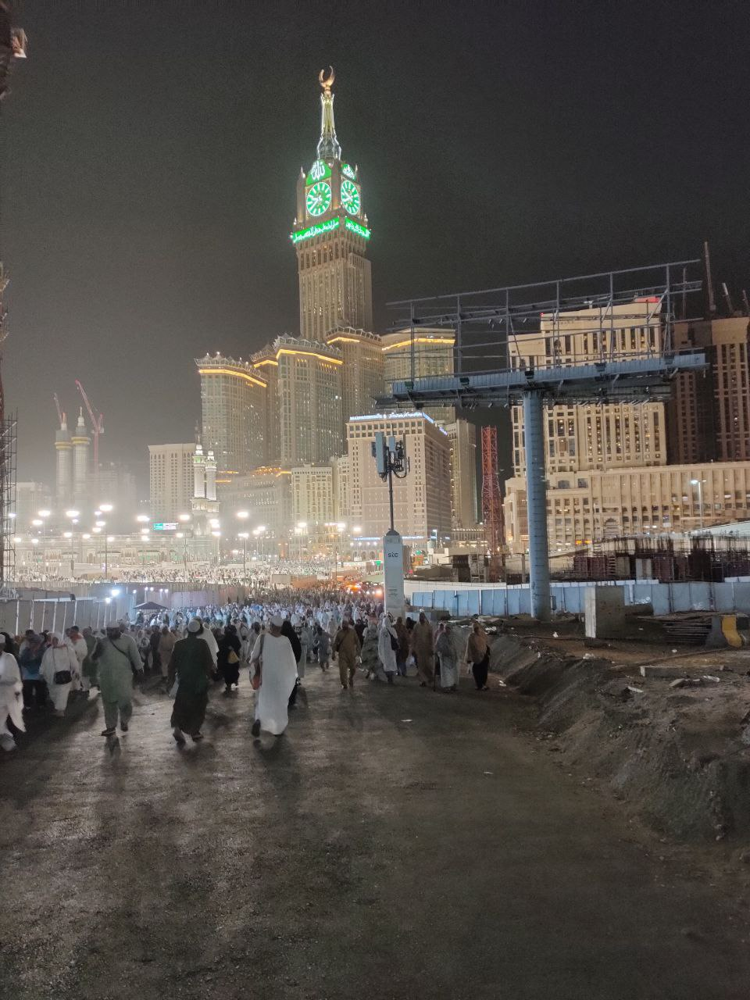

# Intro

Mecca Live gives a short glimpse of the Tawaf and Sai part of the hajj:

<vid>
	<iframe style="width: 650px !important;"
	  src="https://www.youtube.com/embed/moQtMet7F7w?autoplay=1&mute=1&si=xKbnS9JQfIx0wB_F"
	  allow="autoplay"
	></iframe>
</vid>
</br>

Hajj is a difficult trip that starts long before the Hajj season. You may even think that it starts when you are born or when you revert to Islam. Pilgrimage is something that you build up to while gradually fulfilling 5 foundational obligations that the Holy Book and Sunnah instructs you to: 
1. declare the shahadah: "There is no God but God and Muhammad SAW is the Messenger of God."
2. perform 5 daily prayers
3. pay part of your wealth to the poor (Zakat)
4. fast in Ramadan
5. and the fifth pillar of Islam is to perform hajj to the Holy Mosque in Mecca if you are capable of doing so.

Hajj is not obligatory unless you satisfy conditions, such as having enough finances, being physically capable for the journey, as well as being free, sane and reach puberty. Hajj finalizes the five pillars of Islam, as reported in a well-known hadith of the Prophet Muhammad SAW.

	```
	And (due) to Allah from the people is a pilgrimage to the House - for whoever is able to find thereto a way.
	Quran

	And complete the Hajj and Umrah for Allah.
	Quran, surah Al-Baqarah (The Cow) 2:196
	```

I've started thinking about hajj a while ago but wasn't considering myself ready. Was telling myself I should learn more Arabic. Once I came across a narration that khalif Umar RA said something like "I might as well take jizya from them" about those who postpone their hajj without a legitimate excuse because Umar considered them to be out of Islam. You keep stumbling upon the verses of the Quran about Hajar and Ismail, the Kaaba, and the parts of seerah when our prophet Muhammad ﷺ   did tawaf, smaller pilgrimage and of course the Last Hajj with the sermon on Arafat. At a certain point, the realization just comes that it is an obligation upon you to go to Mecca and answer the call of your Creator. It is also interesting how every single Muslim reading the Quran gets nothing less than a personal invitaion from Allah to a place that He reffers to as "Sacred Masjid", "sanctuary for the people", "the Shrine", The Kaaba.

I bought my ihram months before Hajj in the Iqra shop in Neuköln and practiced how to wear it. You can also be burried in your ihram, so that goes like a bonus. Al Ghazali says in his book on Hajj that going to hajj, you should not expect yourself to come back. You need to make sure you wrote the will so that in case you die, whatever belongings you have are distributed to your family, relatives and the poor. Then you register in hajj.nusuk.sa, wait for packages, pay your Euros, apply for the visa, and wait for the flight to Medina.

> Make sure to read [Al Ghazali's Book on Hajj](https://ia800901.us.archive.org/27/items/202247858ImamGhazaliOnTheSecretsOfHajj/202247858-Imam-Ghazali-on-the-Secrets-of-Hajj.pdf) if you are planning your pilgrimage.

When I was talking to one of the hajj agency managers, they said that they have really nice hotels and I thought who needs a fancy hotel there but it turned out that "nice" hotels are the ones that are close to Haram in Mecca.

In 2023, the packages from Germany started from around 7,000 Euro till 10,000 (might be a bit more). The cheapest packages had hotels in Mecca that were far from the Kaaba, like 5-8 kilometers, which really can be unconvenient if you choose to stay longer than 10 days. Sometimes you need to go pray in jamaat in Haram and then go back to the hotel. and in Ramadan or Hajj season the Haram area is so full that getting inside the mosque and finding a place to sit might take up to 1 hour even after reaching the Clock Tower. I've applied for a package from Berlin for 20 days (3 in Medina and 17 in Mecca). Our hotel in Mecca was Voco Hotel which is 30 minutes on foot from Haram and they have shuttles every 15 minutes or so.

Our group was split into two parts, German-speakers and Arabic-speakers and none of them I can understand properly but I've already researched and prepared for the rituals so it was fine. And we had some really good sheikhs, Alhamdulillah, one is an imam in Berlin, originally from Palestine, and a senior sheikh from Morocco for the Arabic group. I would say almost half of the group were Indonesians, German-Turkish people, some people from Tunisia, Bangladesh, one American convert who lives in Germany, and some more.

# Medina

When you land in Medina in summer and exit the flight, hot air strikes your face that feels like opening an oven door. And this grilling weather and scorching sun stayed with us till the last day of the trip. We were extra lucky that year because Hajj season was 27th June-3rd July. It was 42-45 degrees during the day and 27-32 at night. The only place you can get rest is the buildings and buses with full-blast air-conditioning. It was my first time being in a desert so I got sick quiet fast.

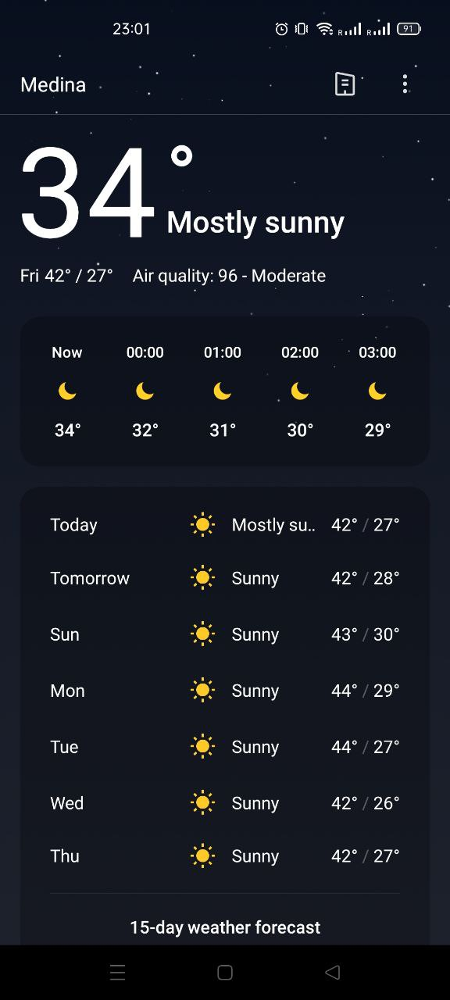    

I have few photos because it is not the right place and time to relax and enjoy what you see. I just took some photos mostly to send to my parents.

Our hotel in Medina was right beside Prophet Muhammad's ﷺ  Mosque and the first thing I saw from the window of my room was a giant construction site on the new wing of the Haram area and the famous umbrellas protecting Muslims under their shade.

Another thing you notice is the portraits of the kings on the walls and the logo of "Vision 2030" is absolutely everywhere, on the uniform of masjid workers, on the construction fences and even on Zam-Zam water bottles. Literally the half of Medina is under construction. 


They are destroying the whole blocks with old houses, even destroying the mountains stone by stone and building new hotels everywhere. In 10 years, if they finish the constructions, Medina will be unrecognizable. As I understand, "Vision 2030" is an attempt of MBS to make Saudi Arabia less-dependent on oil. Saudi is trying to get more investors' money from abroad, making the Arabia attractive to average European and American tourists by building skyscrapers, selling alcohol, inviting dj's, Shakira and throwing big pathetic music festivals. As Sami Hamdi says, the thinking of MBS might be right but the way he is trying to reach that goal contradicts what the Quran and Sunnah says. I personally think following the path of Dubai is a serious mistake. Yes, there are a lot of investment opportunities, people do buy apartments there but what are these places turning into afterwards? I saw recently a group where a Russian-speaking real estate agency was advertising to buy apartments in a new complex near Dubai in an emirate that will have "the first casino!". May Allah protect our holy lands.

They indeed did a good attempt to make the planning and infrastructure of Mecca and Medina safe and comfortable. At least it is much better than before the times where there were fatal stampede. 3-4 million people gathered in one place to do the same thing is a hard crowd to guide. And if people in the Haram areas were not Muslims and they had other goals in mind, the place could get really chaotic. When it comes to skyscrapers and mega projects like the Neom line city, they of course does little sense with all the hunger and poverty in Yemen and African countries in constant tribal wars funded by multiple "civilized" countries in order to be able to buy rear metals for a cheap price.

Another thing that catches the mind of people from a non-Arab country is that everyone calls you "hajji". Every security guard, every hotel worker, merchant, the cleaners of Haram from Philippines, for them we are just one of the millions of hajjis and hajjas came to their workplace. You would think that the title "hajji" should be used only to those who performed hajj but it was interesting for me to learn that it is used all throughout the year, in any season. And you think about how in the old days the tribe of Quraish from Banu Ismail was responsible for feeding and accomodating the pilgrims way before the prophet Muhammad ﷺ   was born. And now, probably all the Quraish people are rich and all these workers are brought from the poorest countries. 

I've learned recently that the Ottomans were building Hejaz railways to connect Istanbul and Mecca. Sadly due to WWI and then the collapse of the latest khalifate, the project was abandoned. The railways from Damascus to Medina however were already built by then and, as I understand, still in service.

The roads in Medina are named after the sahabis. It is so different when you walk on the Abu Dharr Al-Ghifari, Ali ibn Abu Talib street, and then of course you see the roads named after the kings of modern times.

# The Mosque of the Prophet Muhammad ﷺ   (Masjid Al-Nabawi)

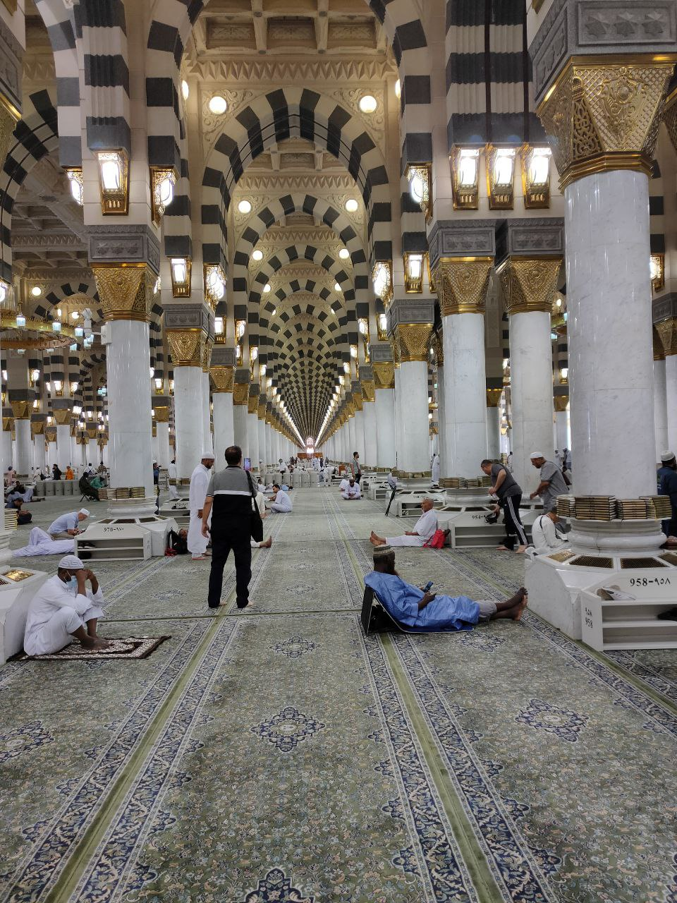
<figc>One wing of Masjid Al-Nabawi in between the prayers while there is still some place to sit</figc>

Medina is beautiful. It is so nice and relaxing in Medina. There is Allah's blessing in the atmosphere and always reminded me of the hadith when Abu Bakr was sick in Medina and wrote a poem about their home Mecca, the prophet Muhammad SAW made dua asking Allah to make Medina more enjoyable than Mecca for muhajireen. and I feel bad for telling the hadith in my own words because imam Malik would make wudhu, put on good clothes, apply perfume, take a sitting position and only then narrate a hadith to the asker.

<div class="image-row">

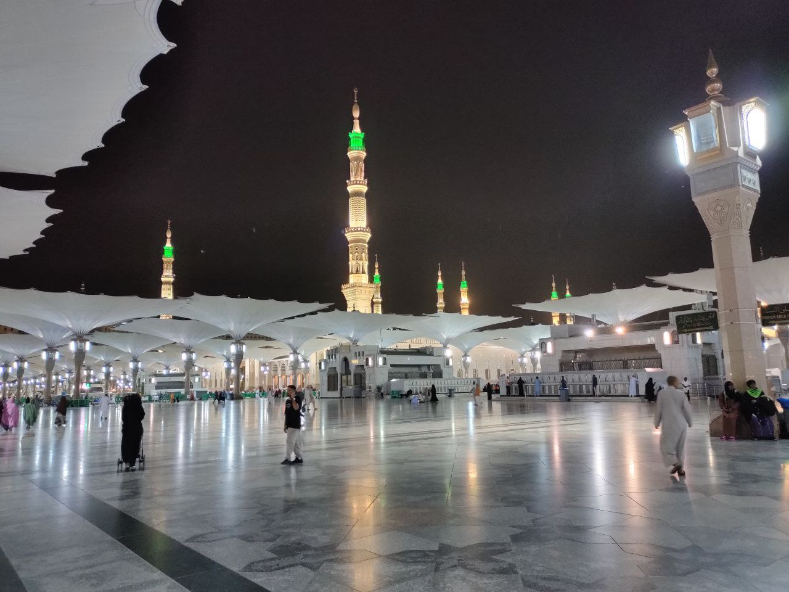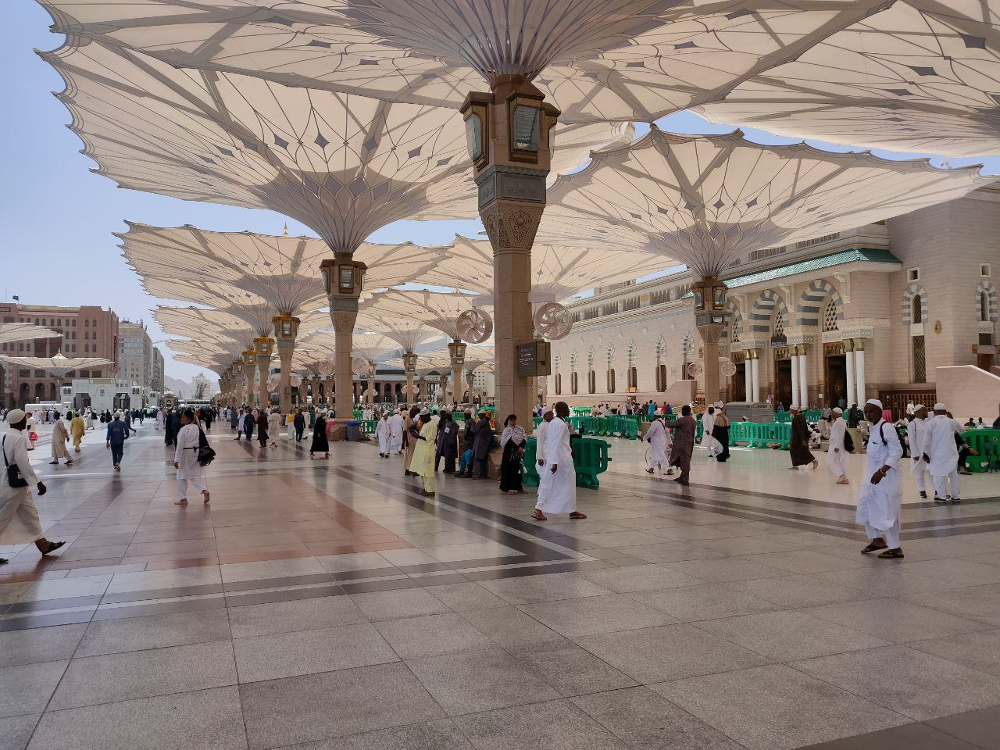

</div>

I don't have many photos, I just took some to send to my parents.

It feels weird to wear European clothes in Medina and Mecca. So, on the first day, you go shopping for some jalabeyas in the shops nearby the Haram. You definitely better do all your shopping here in Medina because it is cheaper maybe by 20-30% (acc to my estimations), and secondly, in Mecca, there is no time for shopping, you go there and have to do your job.

The people of Yemen used to come for Hajj and used not to bring enough provisions with them and used to say that they depend on Allah. On their arrival in Medina they used to beg the people, and so Allah revealed, "And take a provision (with you) for the journey, but the best provision is the fear of Allah." (2.197).

Bukhari, Volume 2, Book 26, Number 598

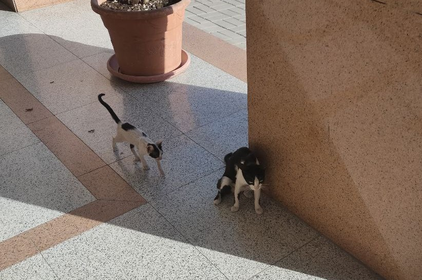

<figc>Local desert cats have long legs and look really thin. Usually hiding in the shadows. </figc>

Other than cats, I've seen only pigeons, doves and crickets; eagles in Mecca and camels here and there on the way to Mecca. Some kind of locusts were flying in swarms around Haram lamps. Probably insects are attracted by cool air and moisture from pulverizers in the Haram area. I've prayed several times on the roof of Masjid Al Haram in Mecca and in the morning and after maghrib, there were birds flying above the mosque. There was no time to look for local animals though.

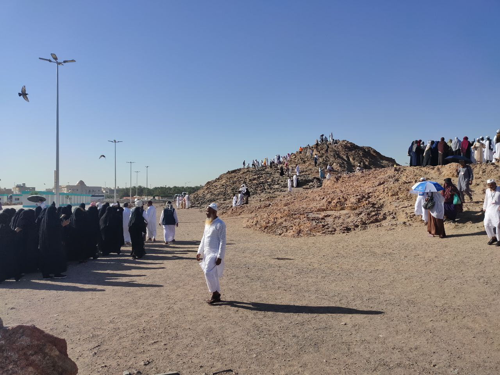
<figc>The hill of Jabal Uhub area where the archers were standing</figc>

We also went to the mount of Uhud. The place where the prophetﷺ   was wounded, the place where Hamza died. Talha ibn UbaydAllah is one of my favorite sahabis. And Uhud is the place where Talha carved his name in the hadiths when he protected the prophetﷺ   from arrows with his own body while most of the Muslim army fled. Abu Bakr said that the battle of Uhud was "the day of Talha". It was interesting to be there after reading about the battle of Uhud from the seerah of the prophet Muhammad ﷺ  .

# Bus from Medina to Mecca

	[22:26-27] We appointed Abraham to establish the Shrine: "You shall not idolize any other god beside Me, and purify My shrine for those who visit it, those who live near it, and those who bow and prostrate. "And proclaim that the people shall observe Hajj pilgrimage.* They will come to you walking or riding on various exhausted (means of transportation). They will come from the farthest locations."

On the road to Mecca there were 4-5 control check points where they count people in the bus. My friend said they are making sure there are no non-Muslims. Sometimes they would give us a bottle of Zam-Zam. Don't drink it though, keep it as a gift.

On the way to Mecca we chanted Labaik Allahuma Labaik for some time. I still get shivers when I hear Labaik. And we stopped to pray Maghrib in the middle of nowhere in the desert. There was only one mosque and a couple of buildings. and a red sunset.

# Umrah

Before I went on this journey, I've spent almost a year researching, reading about the rituals, training to wear ihram, etc. What I did not expect was that the Mecca itself would blow my mind so hard that I did my first umrah in a shocked state.

As I said, it was my first time in Mecca and my first impression of Mecca was absolutely shocking. 


<figc>On the way to Haram</figc>

Mecca is also in the middle of nowhere. It is just a desert with rocky hills. If the Kaaba was somewhere in a city with a sea shore or a nice weather, people could easily turn it into a horrible tourist trap. It's turning into one right now despite being in the middle of the Saudi desert. If there was no Zamzam, there would be no water to drink. If this place was not predestined by God to become a sacred place of worship and a pilgrimage destination, hardly anyone would decide to settle in there by his own will.

After a long bus ride, we arrived at the hotel probably at around midnight, took a shower and went to perform the umrah right away. I've decided to go with the group to be on the safe side. Along the way there were crowds and crowds of sweaty Muslims from all over the world going towards or from the Haram. The scenes of poor large groups of African brothers and sisters sleeping and eating on the ground shook me. And step by step getting through the crowd we were approaching the Haram area. It was difficult to raise my head to see where the Clock Tower ends and walk at the same time. I remember it well. It was noisy and my ear functions started to kind of shut off, the sounds felt weirdly muffled. Security guards and men in ihram everywhere. We entered through the nearest gates, I think it was Bab Al-Salam. After some time sheikh told us to look down and slowly raise our eyes to see the Kaaba for the first time and make a dua. 

Everybody who've been there knows how it feels to do the tawaf around the Kaaba. I used to watch Mecca Live sometimes and on the screen with the smooth Quran recitation of Al Meaqli, the Tawaf on the screen looks so calm and relaxing. In reality, the first time it was the total opposite, there is so much chaos on the ground floor. But soon you start to adjust and just follow the flow. Our sheikh guided us, we tried to keep the group together and surround the women of the group to keep them safer.

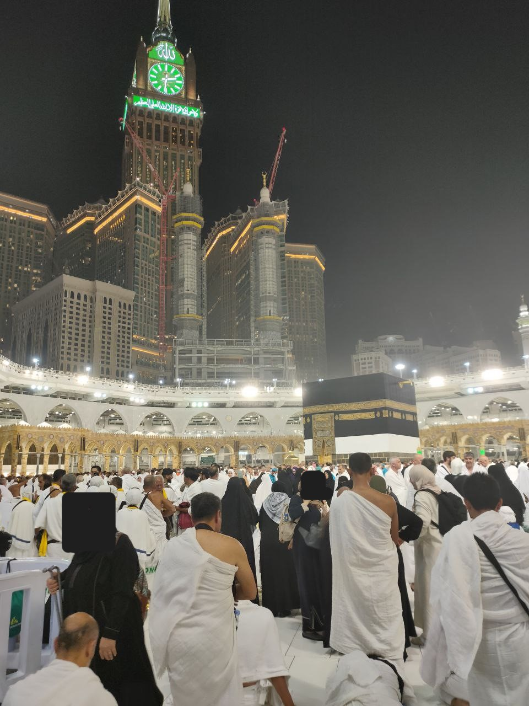

After finishing the 7 rounds around the Kaaba, we prayed behind Maqam Ibrahim, and drank some Zamzam. That was a good Zamzam. Alhamdulillah.

We did the sai between Safa and Marwa I think on the 2 floor and I don't quiet remember how it was. Remember only stopping to make dua after reaching each hill and jogging on green lights.

It all took probably around 3 hours. After finishing the rituals, while we were getting out of Haram, the athan started. So we prayed Fajr. People were exhausted. We went into a building with shops that were fully working even though it was about 4am and got our heads shaved. Our sheikhs said don't pay more than 10 Riyals. The rest I don't remember, I just remember the soothing morning and I still hasn't recovered from the shock. We reached the hotel, washed ourselves and fell into our beds.

# Waiting for Hajj to Start

After performing Umrah we still had almost a week before the beginning of Hajj. These days everybody spends of course going to Haram to pray and back. I was thinking about my parents a lot. I would call them while walking to Haram and show them the rivers of Muslim people. Being from a small town in Tatarstan, even after moving to Europe I couldn't imagine to myself until recently that someday God will lead me to the streets of Mecca swarming with pilgrims. The crowds of Muslims from all over the world, fever, and +45 degress were messing my thoughts. Of course you know that there are hundreds and hundreds millions of practicing Muslims but when you see them all together in one place in same clothes, Asian, African, European, Arab, they are all there. The concentration of Muslims who does not have any other job than going to pray to Haram and back was hard to digest for my brain. It was interesting that my skin didn't get even slightly sunburned even though I didn't use sunscreen.

A few days after Umrah I got sick. Probably was the reaction of my body to what was happening around and the AC. By the end of hajj, almost everyone I knew got sick. and 80% of people were coughing. At the beginning I was happy that I got sick before the Hajj date thinking that I will recover before Mina but I was sick till the very end of the trip. I knew that everybody gets sick there but I didn't expect it to last that long.

In Mecca, you see a lot of things that you might not agree nor understand. My friend said all these tourists, shops, Risa chickens, AC'ed buses, fumes, plastc bottle trash are part of the test now. So, in the old days the whole journey was dangerous and was only for people with a certain level of money, preparation and determnitaion. Now you hop on a plane and an air-conditined bus drives you to a fancy hotel with golden-colored elevators and served meals from chef. And on the way to Kaaba you pass by your poorest brothers sitting on stone, eating rice in the middle of the road. It ovewhelms you and you need extra time to digest what you see.

# Mina

Hajj starts when you leave for Mina. There are some things that I would do differently if I wasn't feverish and if it wasn't my first time in Mecca. One of the things would definitely be to go to Mina on your own without a group. The distance between Haram and EU and American tents in Mina is about 12-13km. Mina itself is a tent "city". and the main thing that bothered me was that after 3.5 hour walk in the crowds in +40-45-degree heat under the sun it would be difficult to find your tent. Every tent looks the same. Also, if you decide to walk give your bag with belongings to brothers in your group, take the minimum on your back. Don't forget water, put on sunscreen, sunglasses, make sure your sandals are soft and comfortable, etc. 

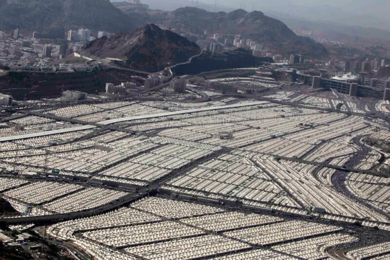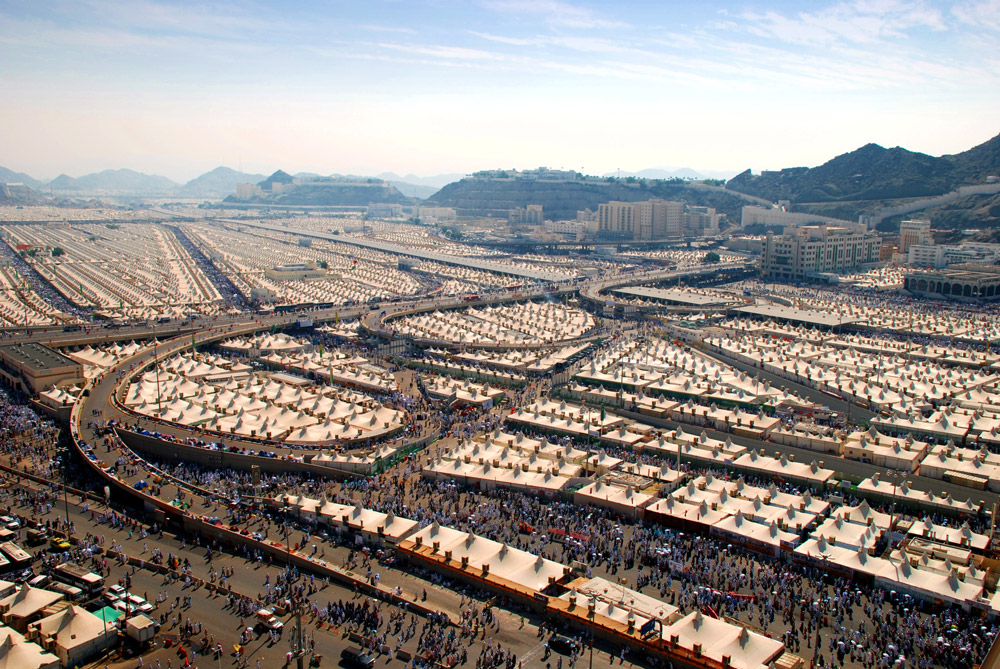
<figc>Assalamu Aleikum! Excuse me, do you know where is the tent 6158? It should be on Street 649.</figc>

Took the pics from [here](https://theislamicinformation.com/news/saudi-arabia-allocated-mina-camps-hajj-2022/) and [here](https://hajjumrahplanner.com/mina/).

Our hotel-roommate in Mecca did all the distance on his own feet and he was 60. I've decided to be on the safe side and save my energy for the Day of Arafat so we took a bus with the group. It should be a totally different feeling when you do all the distances on your feet.

Inside of the tents in Mina might be different according to the country. As I understand, some tents don't have carpets. Tents of groups from EU and Americas are behind the slaughterhouses. Google Maps actually shows to which country the tents belong to, a really helpful feature. Inside the tent, we lived about 100 men. In our tents we had some kind of 50-cm wide mattress that you can convert to a sitting pillow. The place was pretty tight and if when I lay on my back my shoulders would touch my neighbors. When it was time for praying we would fold our mattresses to pray in jamaat. Tents have ACs and it is the only way for Europeans not to get melted.

There was a kitchen where they served food 3 times a day. There are shower facilities combined with toilets that were almost always crowded. On the rush our before prayer or before Arafat you need to wait for 3-5 people who use the bathroom and the shower before you.

Overall, the comfortable conditions during hajj were way better than I expected.

Our group sheikhs made a lecture about Arafat and we stayed there the first night. and slept to get some energy for the main day.

# Arafat

The Prophet Muhammadﷺ   said in a famous Hadith in Tirmidhi: "Hajj is Arafat". So, this is the day. We prayed Fajr, Takbir At-Tashrik and the Talbiyah, had breakfast and started lining up to wait for your turn to take ghusl. I remember my Bengali friend said "Get ready. For this is the most important day of our lives." It is the Day.

We went to Arafat.

Everything you do in Medina and Mecca is building up to this moment. We had a large tent with water supplies and AC. So we started waiting for Dhuhr. There are showers in Arafat but there are more open than in Mina. We made wudhu and prayed shortened and combined Dhuhr and Asr in jamaat. Our Moroccan sheikh made a long nice dua. People were weeping. So after the collective prayer starts the main part of Arafat. THE STANDING. You just stand and make all your prepared dua and then make improvised sincere duas, then you make some salah and make dua again. Again and again. I don't remember exactly what happened there to be honest. Sometimes I'm trying to remember what are the things that I made dua for but I can't. 

It is recommended to make dua outside, especially at the Mount of Rahmah but it was +46. We went outside with my friends a little later when sun started slide down the horizon. I hid for some time under the shade of a fence while supplicating to Allah. The last moments I've spent in some field in Arafat under the shadow of a random tree. The sun was declining and 5th layer of sweat was drying up from heat on my skin.

After the sun sets, The Day of Arafat is over. I remember we went back and were looking for water to drink. I remember sitting outside our tent with my head down feeling a very unusual extraterestial tiredness. I've never been that exhausted. It felt like not only my body but my soul itself was tired. Even after coming back to Berlin after a month I would remember that tiredness. Gives me shivers to this day.

I don't have any photos of Arafat. And it is not the time to make pictures. Hajj is Arafat.

# Sleeping outside in Muzdalifah

Before Arafat, most of people feel nervous. After Arafat, there is a relief. and in the evening, probably almost at night, we went to sleep under the stars in the valley of Muzdalifah.

They even give you snacks and a carpet to sleep. Well, at lands for hujjaj from EU/Americas they do. I wasn't expecting that. Many people just sleep on the ground. We prayed Isha, maybe we prayed Magrib also there in jamaat. You don't really pray without the jamaa in Mecca or Medina. We ate, collected peddles for Jamarat in bottles. The line to the bathrooms is large there so you may have to wait for a while. I washed the sweat a little without going to the shower. and at night it was still like +35 or something. It was noisy and chaotic, I thought I would not fall asleep but the exhaustion got me and I had a nice and needed sleep until I woke up before Fajr. I was lucky to use the washrooms before too many people got up.

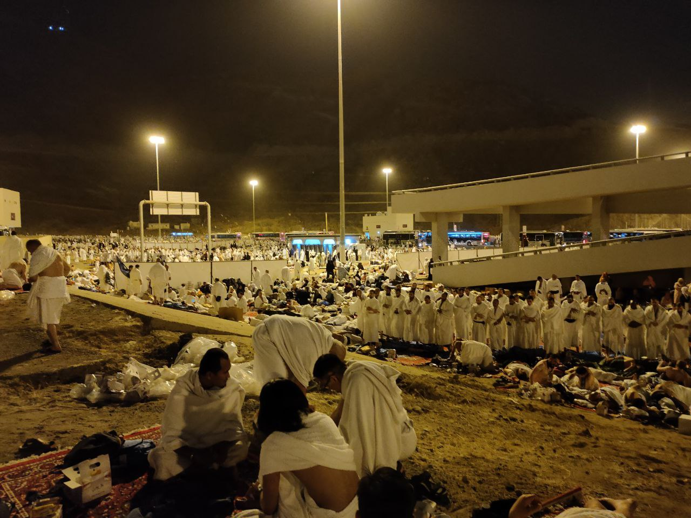

# Walking to Mina

After praying Fajr, our sheikh started gathering the group and we lost someone and we were waiting for about 30 minutes until we realized that they were looking for someone who was already among us:) then we joined the big river of hujjaj flowing by the autobahn-like lanes to Mina and then to Jamarat to throw stones as the prophet Ibrahim AS did. 

There are many moments in Mecca and especially during hajj, when you think "no, this is not right" or "Astagfirullah, this shouldn't be like this". It happens when you see mountains carved up till roots to build another fancy hotel for hajjis. You see it with all this fat fried chicken fast-food restaurants. You feel it while inhaling exhaust fumes of thousands of buses full of pilgrims. You feel it when you start behaving like a tourist in Mecca. And you definitely feel it when leaving Muzdalifah. It was so trashed. The amount of trash hajjis make in those 5 days is just enormous. and in Muzdalifah, there are no tents or skyscrapers that would cover it. 
but you still think about that you did the Arafat and the hardest part of hajj. You better start preparing for your tawaf at this point. 

I've met groups from my homeland of Tatarstan (Russia) several times. Some of the groups had yellow backpacks with a label TATARSTAN. Gave me some warmth every time.

# Mina and Jamarat

After sleeping in Muzdalifah, Mina feels like a home-ish place with comfortable amenities. We had a few hours to take a shower and change our ihram because at this point it is already dirty. From dust of Muzdalifah and the sweat of Arafat. Our sheikhs gathered us and we headed to the tunnels that lead to Jamarat and then to Mecca. Maybe about one third of the way is going through huge overcrowded tunnels. At some point the group started dissolving and I was walking alone. People are still chanting Labayk Allahuma labayk.

It was funny how a security guard was showing a group directions saying "Shaytan is there". and through all the way the guards are standing with pulverizers splashing water onto faces of pilgrims to cool them down. It is an enjoyable part of the Mina-Mecca trails. Nothing special happens in Jamarat, you just need to be careful not to catch a stone in your eye and not to throw your pebbles too hard so that they don't hurt anyone by ricocheting.

Jamarat itself looks like a humongous parking lot from the outsite. From afar it looks like a termite house with millions of pilgrims carrying stones to headshot shaytan.

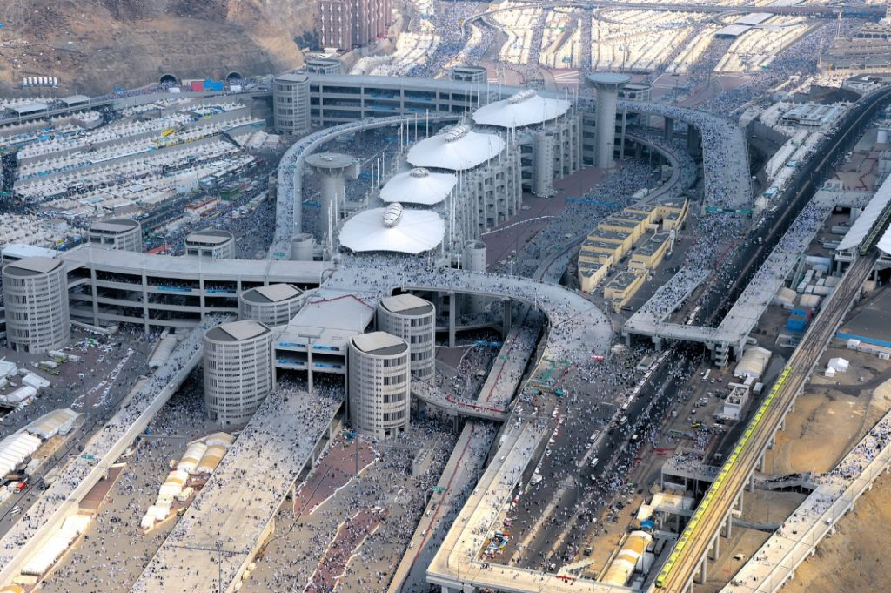

The photo is taken from [the best hajj and umrah planner](https://hajjumrahplanner.com/jamarat-bridge/).

# Tawwaf Al Ziyarah

After Jamarat, you walk to Mecca. On our way we received a message that our kurbani is successfully done.

In Ramadan and in the Hajj season, the ground floor of the tawaf area is fully packed. There are different ways you can do tawwaf and you can choose your pace and the distance to Kaaba. Usually it is recommended to try to gradually come closer to Kaaba till the 4-5 circle and then slowly increase the radius. 

I remember my tawaf after Arafat very good and I want to keep it only to myself and my Lord. Think about the Arafat. My dear friend and neighbor said that among all the chaos, haste and weird things happening around, there are some people who are just peacefully doing their tawaf, praying and making dua. Try to be that person. That was the point where I started to feel the pressure and nervousness coming out of my body and my soul. The most important rites of hajj are already done. Just go to Safa and Marwa seven times and shave your head again.

# Safa and Marwa and Shaving the head

When I went out of Haram after Safa and Marwa, it was past noon and the marble tiles outside were so bright that it sunburned my eyes and made them red and filled with pain for the next week.

This time I shaved my head for 30 Riyals. They increased prices for the hajj season. and I think they were taking 20 from Arab-speaking people. They are at the highest level of head-shaving experience. They shave your head so fast, you don't even have time to find a comfortable position on the chair to relax a little.

I don't remember the rest of the day. Probably I walked to the hotel, took a shower and went to bed to recover. InshaAllah, the main part of my hajj was complete.

In the evening, returned to Mina to spend the night there.

# Jamarat and Mina

The next 2 or 3 days you do the Jamarat. And on the 5th of Dhul Hijja, it is allowed to return to Mecca after throwing pebbles. Almost everyone chose to go back to the hotel. On the last day, me with my American and Bengali friend went through the valleys and tunnels to Jamarat and then slowly returned to Mecca. The passage from the left side between the mountain and Haram was closed so we had to go through Haram but got lost. While we were trying to find an open exit, the athan started, so we stayed and prayed before leaving. Probably it was Asr. Then we probably went to the hotel. I don't remember. Our Hajj was complete.

# Preparing to go back

After Hajj was over, we had only three days before our flight home. In those days you can pay the fidya if you did a violations of some hajj rules. Sadaqah for minor violation or give kurbani (damm) for major violations (varies depending on the mazhab). There are offices in the Clock Tower where you can pay the fidya or damm. For Sadaqa, you can also just feed the people next to the haram area, a lot of poor people there.

After recovering a little from Arafat, we used to go back to Kaaba and started preparing to go home. And in the last day, you do the Farewell Tawaf (not in ihram). That should be the last thing you do in Mecca.

# Post-Hajj

</br>

After any event that one can call an "experience", something changes. I was feeling so weird after Arafat. Whenever I go through my memories, these flashbacks from Arafat or Haram make me start panting from heat. Make me feel disoriented. It makes me lower my head. You go back home, your hair start to grow again, you wait at the traffic lights and think to yourself "what am I doing here?".

I remember buying soup in a supermarket in Denmark and drink it before our nikah. I was still coughing after one month. There is even a special term "hajj cough".

And when circulating around the Kaaba for the second time, think about the angels who in their thousands come to worship God and circumambulate Al-Bait Al-Mamoor to never come back again. It is a hard journey but I hope one day inshaAllah to come back with my family. And especially, if God wills, I want to visit Mecca and Medina with my parents. I want to be there when they see the Kaaba.

	[48:27] GOD has fulfilled His messenger's truthful vision: "You will enter the Sacred Masjid, GOD willing, perfectly secure, and you will cut your hair or shorten it (as you fulfill the pilgrimage rituals) there. You will not have any fear. Since He knew what you did not know, He has coupled this with an immediate victory."

We all know this episode of the seerah of the prophet ﷺ   when this ayah was descended.

	Labaik Allahuma labaik.

I personally think it is a great phrase to say on your death bed. Here I am, oh Lord. I hear your call and I come. But, as the hadith says, noone is safe from the tribulations of the grave. It is our obligation to die upon shahada. And you cannot die upon shahada if you haven't lived upon it. And our beloved prophet Muhammad ﷺ   was the best to choose words when he died. Repeating "the companionship of The Most High, the companionship of The Most High". May Allah let our tongues speak the words of shahada when we die.


